<h1>Table of Contents<span class="tocSkip"></span></h1>
<div class="toc"><ul class="toc-item"><li><span><a href="#Project-Overview" data-toc-modified-id="Project-Overview-1"><span class="toc-item-num">1&nbsp;&nbsp;</span>Project Overview</a></span></li><li><span><a href="#Import-Libraries-&amp;-Connect-to-Database" data-toc-modified-id="Import-Libraries-&amp;-Connect-to-Database-2"><span class="toc-item-num">2&nbsp;&nbsp;</span>Import Libraries &amp; Connect to Database</a></span></li><li><span><a href="#Class:-DistChecker" data-toc-modified-id="Class:-DistChecker-3"><span class="toc-item-num">3&nbsp;&nbsp;</span>Class: DistChecker</a></span></li><li><span><a href="#Function:-Cohen_d" data-toc-modified-id="Function:-Cohen_d-4"><span class="toc-item-num">4&nbsp;&nbsp;</span>Function: Cohen_d</a></span></li><li><span><a href="#Question-#-1a:-Discount-&amp;-Order-Quantity" data-toc-modified-id="Question-#-1a:-Discount-&amp;-Order-Quantity-5"><span class="toc-item-num">5&nbsp;&nbsp;</span>Question # 1a: Discount &amp; Order Quantity</a></span><ul class="toc-item"><li><span><a href="#Obtain" data-toc-modified-id="Obtain-5.1"><span class="toc-item-num">5.1&nbsp;&nbsp;</span>Obtain</a></span></li><li><span><a href="#Scrub-/-Explore" data-toc-modified-id="Scrub-/-Explore-5.2"><span class="toc-item-num">5.2&nbsp;&nbsp;</span>Scrub / Explore</a></span></li><li><span><a href="#Test:-Welch's-2-sample-t-test" data-toc-modified-id="Test:-Welch's-2-sample-t-test-5.3"><span class="toc-item-num">5.3&nbsp;&nbsp;</span>Test: Welch's 2-sample t-test</a></span></li><li><span><a href="#Interpretation" data-toc-modified-id="Interpretation-5.4"><span class="toc-item-num">5.4&nbsp;&nbsp;</span>Interpretation</a></span><ul class="toc-item"><li><span><a href="#Sub-Question-1a" data-toc-modified-id="Sub-Question-1a-5.4.1"><span class="toc-item-num">5.4.1&nbsp;&nbsp;</span>Sub-Question 1a</a></span></li></ul></li><li><span><a href="#Interpretation:-Question-1a" data-toc-modified-id="Interpretation:-Question-1a-5.5"><span class="toc-item-num">5.5&nbsp;&nbsp;</span>Interpretation: Question 1a</a></span></li></ul></li><li><span><a href="#Question-#-1b:-Level-of-Discount-&amp;-Order-Quantity" data-toc-modified-id="Question-#-1b:-Level-of-Discount-&amp;-Order-Quantity-6"><span class="toc-item-num">6&nbsp;&nbsp;</span>Question # 1b: Level of Discount &amp; Order Quantity</a></span><ul class="toc-item"><li><span><a href="#Obtain" data-toc-modified-id="Obtain-6.1"><span class="toc-item-num">6.1&nbsp;&nbsp;</span>Obtain</a></span></li><li><span><a href="#Test:-Tukey's-HSD-Multiple-Comparison" data-toc-modified-id="Test:-Tukey's-HSD-Multiple-Comparison-6.2"><span class="toc-item-num">6.2&nbsp;&nbsp;</span>Test: Tukey's HSD Multiple Comparison</a></span></li><li><span><a href="#Interpretation:-Question-1b" data-toc-modified-id="Interpretation:-Question-1b-6.3"><span class="toc-item-num">6.3&nbsp;&nbsp;</span>Interpretation: Question 1b</a></span></li></ul></li><li><span><a href="#Question-#-2:-Shipper-&amp;-Freight-Price" data-toc-modified-id="Question-#-2:-Shipper-&amp;-Freight-Price-7"><span class="toc-item-num">7&nbsp;&nbsp;</span>Question # 2: Shipper &amp; Freight Price</a></span><ul class="toc-item"><li><span><a href="#Obtain" data-toc-modified-id="Obtain-7.1"><span class="toc-item-num">7.1&nbsp;&nbsp;</span>Obtain</a></span></li><li><span><a href="#Scrub-/-Explore" data-toc-modified-id="Scrub-/-Explore-7.2"><span class="toc-item-num">7.2&nbsp;&nbsp;</span>Scrub / Explore</a></span></li><li><span><a href="#Test:-One-Way-ANOVA-(Kruskal-Wallis)" data-toc-modified-id="Test:-One-Way-ANOVA-(Kruskal-Wallis)-7.3"><span class="toc-item-num">7.3&nbsp;&nbsp;</span>Test: One-Way ANOVA (Kruskal-Wallis)</a></span></li><li><span><a href="#Interpretation:-Question-2" data-toc-modified-id="Interpretation:-Question-2-7.4"><span class="toc-item-num">7.4&nbsp;&nbsp;</span>Interpretation: Question 2</a></span></li></ul></li><li><span><a href="#Question-#-3:-Employee-&amp;-Orders-per-Customer" data-toc-modified-id="Question-#-3:-Employee-&amp;-Orders-per-Customer-8"><span class="toc-item-num">8&nbsp;&nbsp;</span>Question # 3: Employee &amp; Orders per Customer</a></span><ul class="toc-item"><li><span><a href="#Obtain" data-toc-modified-id="Obtain-8.1"><span class="toc-item-num">8.1&nbsp;&nbsp;</span>Obtain</a></span></li><li><span><a href="#Scrub-/-Explore" data-toc-modified-id="Scrub-/-Explore-8.2"><span class="toc-item-num">8.2&nbsp;&nbsp;</span>Scrub / Explore</a></span></li><li><span><a href="#Test:-Kruskal-Wallis-Test" data-toc-modified-id="Test:-Kruskal-Wallis-Test-8.3"><span class="toc-item-num">8.3&nbsp;&nbsp;</span>Test: Kruskal-Wallis Test</a></span></li><li><span><a href="#Post-Hoc-Test:-Dunn's-Test" data-toc-modified-id="Post-Hoc-Test:-Dunn's-Test-8.4"><span class="toc-item-num">8.4&nbsp;&nbsp;</span>Post-Hoc Test: Dunn's Test</a></span></li><li><span><a href="#Interpretation:-Question-3" data-toc-modified-id="Interpretation:-Question-3-8.5"><span class="toc-item-num">8.5&nbsp;&nbsp;</span>Interpretation: Question 3</a></span></li></ul></li><li><span><a href="#Question-#-4:-Time-of-Year-&amp;-Quantity-Product-in-Order" data-toc-modified-id="Question-#-4:-Time-of-Year-&amp;-Quantity-Product-in-Order-9"><span class="toc-item-num">9&nbsp;&nbsp;</span>Question # 4: Time of Year &amp; Quantity Product in Order</a></span><ul class="toc-item"><li><span><a href="#Obtain" data-toc-modified-id="Obtain-9.1"><span class="toc-item-num">9.1&nbsp;&nbsp;</span>Obtain</a></span></li><li><span><a href="#Scrub-/-Explore" data-toc-modified-id="Scrub-/-Explore-9.2"><span class="toc-item-num">9.2&nbsp;&nbsp;</span>Scrub / Explore</a></span></li><li><span><a href="#Test:-One-Way-ANOVA-(Kruskal-Wallis)" data-toc-modified-id="Test:-One-Way-ANOVA-(Kruskal-Wallis)-9.3"><span class="toc-item-num">9.3&nbsp;&nbsp;</span>Test: One-Way ANOVA (Kruskal-Wallis)</a></span></li><li><span><a href="#Post-Hoc-Test:-Tukey's-HSD" data-toc-modified-id="Post-Hoc-Test:-Tukey's-HSD-9.4"><span class="toc-item-num">9.4&nbsp;&nbsp;</span>Post-Hoc Test: Tukey's HSD</a></span></li><li><span><a href="#Interpretation:-Question-4" data-toc-modified-id="Interpretation:-Question-4-9.5"><span class="toc-item-num">9.5&nbsp;&nbsp;</span>Interpretation: Question 4</a></span></li></ul></li><li><span><a href="#Conclusions" data-toc-modified-id="Conclusions-10"><span class="toc-item-num">10&nbsp;&nbsp;</span>Conclusions</a></span><ul class="toc-item"><li><span><a href="#Recommendations" data-toc-modified-id="Recommendations-10.1"><span class="toc-item-num">10.1&nbsp;&nbsp;</span>Recommendations</a></span></li><li><span><a href="#Future-Work" data-toc-modified-id="Future-Work-10.2"><span class="toc-item-num">10.2&nbsp;&nbsp;</span>Future Work</a></span></li></ul></li></ul></div>

Project: Mod 3 Final Project - Northwind Database Hypothesis Testing

Student: Douglas Steen

Instructor: James Irving, PhD

Date of Project Review: 12/13/2019

Cohort: ds-ft-10072019

# Project Overview 
The purpose of this study is to  perform specific hypothesis tests to gain actionable insights that can be used by Northwind managment to improve business strategy and efficiency. The study aims to answer the following questions, and provide recommendations based on the results.

Question # 1:
Does discount amount have a statistically significant effect on the quantity of a product in an order? If so, at what level(s) of discount?

Question # 2:
Does the shipper used have a statistically significant effect on freight price?

Question # 3:
Does the specific employee have a statistically significant effect on the number of repeat orders their customers make?

Question # 4:
Does the time of year have a statistically significant effect on quantity of a product per order?

# Import Libraries & Connect to Database


```python
import statsmodels.api as sm
from statsmodels.stats.power import TTestIndPower
import numpy as np
import scipy.stats as stats
import seaborn as sns
import sqlite3
import pandas as pd
import matplotlib.pyplot as plt
import warnings
warnings.simplefilter(action='ignore')
%matplotlib inline
sns.set_style('darkgrid')
sns.set_context(context='notebook')

!pip install scikit-posthocs
import scikit_posthocs as sp
```

    Requirement already satisfied: scikit-posthocs in c:\users\dougl\anaconda3\envs\learn-env\lib\site-packages (0.6.1)
    Requirement already satisfied: scipy in c:\users\dougl\anaconda3\envs\learn-env\lib\site-packages (from scikit-posthocs) (1.3.1)
    Requirement already satisfied: matplotlib in c:\users\dougl\anaconda3\envs\learn-env\lib\site-packages (from scikit-posthocs) (3.1.1)
    Requirement already satisfied: statsmodels in c:\users\dougl\anaconda3\envs\learn-env\lib\site-packages (from scikit-posthocs) (0.10.1)
    Requirement already satisfied: seaborn in c:\users\dougl\anaconda3\envs\learn-env\lib\site-packages (from scikit-posthocs) (0.9.0)
    Requirement already satisfied: pandas>=0.20.0 in c:\users\dougl\anaconda3\envs\learn-env\lib\site-packages (from scikit-posthocs) (0.25.1)
    Requirement already satisfied: numpy in c:\users\dougl\anaconda3\envs\learn-env\lib\site-packages (from scikit-posthocs) (1.16.5)
    Requirement already satisfied: cycler>=0.10 in c:\users\dougl\anaconda3\envs\learn-env\lib\site-packages (from matplotlib->scikit-posthocs) (0.10.0)
    Requirement already satisfied: kiwisolver>=1.0.1 in c:\users\dougl\anaconda3\envs\learn-env\lib\site-packages (from matplotlib->scikit-posthocs) (1.1.0)
    Requirement already satisfied: pyparsing!=2.0.4,!=2.1.2,!=2.1.6,>=2.0.1 in c:\users\dougl\anaconda3\envs\learn-env\lib\site-packages (from matplotlib->scikit-posthocs) (2.4.2)
    Requirement already satisfied: python-dateutil>=2.1 in c:\users\dougl\anaconda3\envs\learn-env\lib\site-packages (from matplotlib->scikit-posthocs) (2.8.0)
    Requirement already satisfied: patsy>=0.4.0 in c:\users\dougl\anaconda3\envs\learn-env\lib\site-packages (from statsmodels->scikit-posthocs) (0.5.1)
    Requirement already satisfied: pytz>=2017.2 in c:\users\dougl\anaconda3\envs\learn-env\lib\site-packages (from pandas>=0.20.0->scikit-posthocs) (2019.3)
    Requirement already satisfied: six in c:\users\dougl\anaconda3\envs\learn-env\lib\site-packages (from cycler>=0.10->matplotlib->scikit-posthocs) (1.12.0)
    Requirement already satisfied: setuptools in c:\users\dougl\anaconda3\envs\learn-env\lib\site-packages (from kiwisolver>=1.0.1->matplotlib->scikit-posthocs) (41.4.0)
    


```python
# Instantiate a cursor object and connect to the Northwind sqlite database

conn = sqlite3.connect('Northwind_small.sqlite')
cur = conn.cursor()
```

# Class: DistChecker
This is a class of functions that I will use to: 1) Test normality of distributioons, 2) plot distributions, 3) return basic summary info for a given distribution.


```python
class DistChecker():
    """Creates a DistChecker object. Class of functions to aid in visualizing a distribution and its normality."""

    def __init__(self, X, name):
        """
        __init__ function for DistChecker object.

        Parameters
        ----------
        X : array-like
            The observations of the data to be checked
        name : str
            Name of the data distribution to be referenced in function outputs

        Returns
        -------
        None
        """
        self.X = X
        self.name = name

    def norm_tests(self, alpha=0.05, dist='norm'):
        """
        Returns results of three common distribution normality tests: Shapiro-Wilk, D'Agostino Pearson, and Anderson-Darling.

        Parameters
        ----------
        alpha : float
            significance level for the test (default=0.05)
        dist : str
            type of distribution used for the Anderson-Darling test (default='norm')

        Returns
        -------
        Statement of whether the null hypothesis (that samples were drawn from a normal distribution) is rejected or not rejected for each test.
        """
        self.alpha = alpha
        self.dist = dist

        # Shapiro-Wilk Test
        self.W, self.p_val1 = stats.shapiro(self.X)
        if self.p_val1 <= alpha:
            print(f'SHAPIRO-WILK TEST at alpha = {self.alpha}:')
            print(
                f'The null hypothesis that sample was drawn from a normal distribution is REJECTED at p = {self.p_val1}\n')
        else:
            print(f'SHAPIRO-WILK TEST at alpha = {self.alpha}:')
            print(
                f'The null hypothesis that sample data was drawn from a normal distribution is NOT REJECTED at p = {self.p_val1}\n')

        # D'Agostino-Person Test
        self.st, self.p_val2 = stats.normaltest(self.X)
        if self.p_val1 <= alpha:
            print(f"D'AGOSTINO-PEARSON TEST at alpha = {self.alpha}:")
            print(
                f'The null hypothesis that sample was drawn from a normal distribution is REJECTED at p = {self.p_val2}\n')
        else:
            print(f"D'AGOSTINO-PEARSON TEST at alpha = {self.alpha}:")
            print(
                f'The null hypothesis that sample was drawn from a normal distribution is NOT REJECTED at p = {self.p_val2}\n')

        # Anderson-Darling Test
        self.statistic, self.crit, self.sig = stats.anderson(self.X, self.dist)
        # This compares statistic to critical value at alpha=0.05
        if self.statistic > self.crit[2]:
            print(f"ANDERSON-DARLING TEST at alpha = {self.alpha}:")
            print(
                f'The null hypothesis that sample was drawn from a normal distribution is REJECTED.')
            print(
                f'Test Statistic: {self.statistic} > Critical Value {self.crit[2]}')
        else:
            print(f"ANDERSON-DARLING TEST at alpha = {self.alpha}:")
            print(
                f'The null hypothesis that sample was drawn from a normal distribution is NOT REJECTED.')
            print(
                f'Test Statistic: {self.statistic} < Critical Value {self.crit[2]}')

    def plot_dist(self):
        """Returns seaborn distplot with mean value indicated for the distribution."""
        plt.figure(figsize=(6, 6))
        sns.distplot(self.X, color='black')
        plt.axvline(np.mean(self.X), linewidth=3, c='blue',
                    label=f'Mean = {round(np.mean(self.X),2)}', linestyle='--')
        plt.ylabel('Prob')
        plt.title(self.name + ' Distribution')
        plt.legend()
        plt.show()

    def summary_info(self):
        """Returns summary statistics, value counts, and number of null values (if present)."""
        nulls = self.X.isnull().sum()
        print(f'{self.name} distribution summary statistics:\n\n',
              self.X.describe())
        print(f'\n\n{self.name} distribution value counts:\n\n',
              self.X.value_counts())
        if nulls:
            print(f'\n{self.name} data contains {nulls} null values.\n')
```

# Function: Cohen_d


```python
def Cohen_d(group1, group2):
    """
    Compute Cohen's d effect size of group1 and group2.

    Parameters
    ----------
    group1 : array-like
    group2 : array-like

    Returns
    -------
    Cohen's d effect size (float). 
    """
    diff = group1.mean() - group2.mean()

    n1, n2 = len(group1), len(group2)
    var1 = group1.var()
    var2 = group2.var()

    # Calculate the pooled threshold as shown earlier
    pooled_var = (n1 * var1 + n2 * var2) / (n1 + n2)

    # Calculate Cohen's d statistic
    d = diff / np.sqrt(pooled_var)

    return d
```

# Question # 1a: Discount & Order Quantity

Question: (1a) Does discount amount have a statistically significant effect on the quantity of a product in an order? (1b) If so, at what level(s) of discount?

Null Hypothesis: Discount amount (at all levels) has no effect on the quantity of a product in an order.

Alt. Hypothesis: The presence of a discount (at all levels) has an effect on the quantity of a product in an order.

## Obtain

Obtain necessary data from Northwind SQL database to answer Question #1

-Want to visualize all variables in the OrderDetail table


```python
# Obtain OrderDetail table, create a pandas dataframe for all entries with no (0) discount

cur.execute("""SELECT * FROM OrderDetail WHERE Discount == 0;""")
q1df_nd = pd.DataFrame(cur.fetchall())
q1df_nd.columns = [x[0] for x in cur.description]
q1df_nd.drop(labels='Id', inplace=True, axis=1)
q1df_nd.head()
```


<div>
<style scoped>
    .dataframe tbody tr th:only-of-type {
        vertical-align: middle;
    }

    .dataframe tbody tr th {
        vertical-align: top;
    }

    .dataframe thead th {
        text-align: right;
    }
</style>
<table border="1" class="dataframe">
  <thead>
    <tr style="text-align: right;">
      <th></th>
      <th>OrderId</th>
      <th>ProductId</th>
      <th>UnitPrice</th>
      <th>Quantity</th>
      <th>Discount</th>
    </tr>
  </thead>
  <tbody>
    <tr>
      <td>0</td>
      <td>10248</td>
      <td>11</td>
      <td>14.0</td>
      <td>12</td>
      <td>0.0</td>
    </tr>
    <tr>
      <td>1</td>
      <td>10248</td>
      <td>42</td>
      <td>9.8</td>
      <td>10</td>
      <td>0.0</td>
    </tr>
    <tr>
      <td>2</td>
      <td>10248</td>
      <td>72</td>
      <td>34.8</td>
      <td>5</td>
      <td>0.0</td>
    </tr>
    <tr>
      <td>3</td>
      <td>10249</td>
      <td>14</td>
      <td>18.6</td>
      <td>9</td>
      <td>0.0</td>
    </tr>
    <tr>
      <td>4</td>
      <td>10249</td>
      <td>51</td>
      <td>42.4</td>
      <td>40</td>
      <td>0.0</td>
    </tr>
  </tbody>
</table>
</div>


```python
# Obtain OrderDetail table, create a pandas dataframe with results for any level of discount > 0

cur.execute("""SELECT * FROM OrderDetail WHERE Discount > 0;""")
q1df_d = pd.DataFrame(cur.fetchall())
q1df_d.columns = [x[0] for x in cur.description]
q1df_d.drop(labels='Id', inplace=True, axis=1)
q1df_d.head()
```


<div>
<style scoped>
    .dataframe tbody tr th:only-of-type {
        vertical-align: middle;
    }

    .dataframe tbody tr th {
        vertical-align: top;
    }

    .dataframe thead th {
        text-align: right;
    }
</style>
<table border="1" class="dataframe">
  <thead>
    <tr style="text-align: right;">
      <th></th>
      <th>OrderId</th>
      <th>ProductId</th>
      <th>UnitPrice</th>
      <th>Quantity</th>
      <th>Discount</th>
    </tr>
  </thead>
  <tbody>
    <tr>
      <td>0</td>
      <td>10250</td>
      <td>51</td>
      <td>42.4</td>
      <td>35</td>
      <td>0.15</td>
    </tr>
    <tr>
      <td>1</td>
      <td>10250</td>
      <td>65</td>
      <td>16.8</td>
      <td>15</td>
      <td>0.15</td>
    </tr>
    <tr>
      <td>2</td>
      <td>10251</td>
      <td>22</td>
      <td>16.8</td>
      <td>6</td>
      <td>0.05</td>
    </tr>
    <tr>
      <td>3</td>
      <td>10251</td>
      <td>57</td>
      <td>15.6</td>
      <td>15</td>
      <td>0.05</td>
    </tr>
    <tr>
      <td>4</td>
      <td>10252</td>
      <td>20</td>
      <td>64.8</td>
      <td>40</td>
      <td>0.05</td>
    </tr>
  </tbody>
</table>
</div>


```python
# Save the desired variables (pull quantity from each dataframe)

A1 = q1df_nd.Quantity
B1 = q1df_d.Quantity
```

## Scrub / Explore

Visualize distributions, edit problem values if necessary.


```python
# Check distribution of Quantities with no Discount

q1_nd = DistChecker(A1, 'Quantity without Discount')
q1_nd.plot_dist()
q1_nd.summary_info()
q1_nd.norm_tests()
```


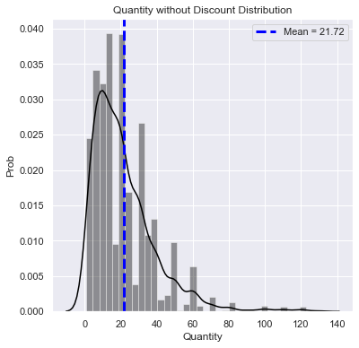


    Quantity without Discount distribution summary statistics:
    
     count    1317.000000
    mean       21.715262
    std        17.507493
    min         1.000000
    25%        10.000000
    50%        18.000000
    75%        30.000000
    max       130.000000
    Name: Quantity, dtype: float64
    
    
    Quantity without Discount distribution value counts:
    
     20     154
    10     130
    30     122
    15     100
    6       62
    40      60
    12      57
    5       53
    25      44
    35      42
    50      40
    4       39
    24      36
    3       34
    2       30
    21      30
    60      30
    8       29
    14      28
    18      24
    9       22
    16      21
    28      18
    7       17
    1       13
    70      10
    36       9
    45       9
    42       8
    80       6
    55       4
    100      4
    120      3
    32       3
    48       3
    49       3
    65       3
    110      3
    39       2
    44       2
    130      1
    13       1
    22       1
    52       1
    56       1
    63       1
    77       1
    90       1
    91       1
    33       1
    Name: Quantity, dtype: int64
    SHAPIRO-WILK TEST at alpha = 0.05:
    The null hypothesis that sample was drawn from a normal distribution is REJECTED at p = 3.803856556577728e-34
    
    D'AGOSTINO-PEARSON TEST at alpha = 0.05:
    The null hypothesis that sample was drawn from a normal distribution is REJECTED at p = 5.579637380545965e-119
    
    ANDERSON-DARLING TEST at alpha = 0.05:
    The null hypothesis that sample was drawn from a normal distribution is REJECTED.
    Test Statistic: 44.59835234133561 > Critical Value 0.785
    

This distribution is clearly NOT normally distributed, with a mean of 21.7, contains 1317 values, no null/missing.


```python
# Check distribution of Quantities with Discount

q1_d = DistChecker(B1, 'Quantity with Discount')
q1_d.plot_dist()
q1_d.summary_info()
q1_d.norm_tests()
```


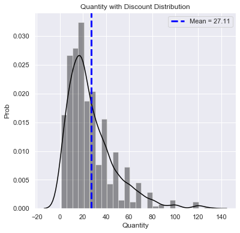


    Quantity with Discount distribution summary statistics:
    
     count    838.000000
    mean      27.109785
    std       20.771439
    min        1.000000
    25%       12.000000
    50%       20.000000
    75%       36.000000
    max      130.000000
    Name: Quantity, dtype: float64
    
    
    Quantity with Discount distribution value counts:
    
     20     98
    30     72
    15     69
    40     53
    10     51
    25     36
    50     35
    12     35
    35     29
    60     28
    6      25
    18     23
    24     22
    2      22
    8      21
    21     20
    70     18
    4      16
    5      14
    16     14
    36     12
    3      12
    42     11
    28     11
    80     10
    14      8
    9       8
    7       6
    100     6
    55      5
    65      5
    45      5
    120     5
    1       4
    49      4
    90      3
    11      2
    32      2
    13      2
    27      2
    44      2
    48      2
    56      2
    77      2
    84      2
    33      1
    54      1
    66      1
    130     1
    Name: Quantity, dtype: int64
    SHAPIRO-WILK TEST at alpha = 0.05:
    The null hypothesis that sample was drawn from a normal distribution is REJECTED at p = 6.88120409395894e-26
    
    D'AGOSTINO-PEARSON TEST at alpha = 0.05:
    The null hypothesis that sample was drawn from a normal distribution is REJECTED at p = 1.6214878452829618e-57
    
    ANDERSON-DARLING TEST at alpha = 0.05:
    The null hypothesis that sample was drawn from a normal distribution is REJECTED.
    Test Statistic: 27.575899559691948 > Critical Value 0.783
    

This distribution is clearly NOT normally distributed, with a mean of 27.1, contains 838 values, and no null/missing values.

However, since each sample is very large (n > 20), we can ignore the normality assumption here and use a two-sided, Welch's two-sample t-test.

## Test: Welch's 2-sample t-test

Does discount amount have a statistically significant effect on the quantity of a product in an order?


```python
# Welch's two-sample t-test

t_1, p_1 = stats.ttest_ind(A1, B1, equal_var=False)
print(f't-statistic: {t_1}')
print(f'p_value: {p_1}')
```

    t-statistic: -6.239069142123973
    p_value: 5.65641429030433e-10
    


```python
# Just as a check, run non-parametric Mann-Whitney Test to confirm/deny result

stats.mannwhitneyu(A1, B1, alternative='two-sided')
```


    MannwhitneyuResult(statistic=461541.0, pvalue=1.3258763653999732e-10)


## Interpretation

As a result of the significant result of the welch's t-test, we can reject the null hypothesis that discount has no effect on the quantity of a product in an order.


```python
# Distribution and mean with standard error plots figure

plt.figure(figsize=(14, 7))

plt.subplot(121)
sns.set_style('darkgrid')
sns.set_context('notebook')
ax1 = sns.distplot(A1, color='blue', label='Quantity Without Discount')
plt.axvline(x=np.mean(A1), linestyle='--', color='blue',
            label=f'Mean = {round(np.mean(A1), 2)}')
ax2 = sns.distplot(B1, color='red', label='Quantity With Discount')
plt.axvline(x=np.mean(B1), linestyle='--', color='red',
            label=f'Mean = {round(np.mean(B1), 2)}')
plt.ylabel('Probabiliy Density')
plt.legend()

plt.subplot(122)
sns.set_style('darkgrid')
sns.set_context('notebook')
plt.bar(x='Quantity Without Discount', height=np.mean(
    A1), color='blue', alpha=0.5, yerr=stats.sem(A1))
plt.bar(x='Quantity With Discount', height=np.mean(
    B1), color='red', alpha=0.5, yerr=stats.sem(B1))
plt.ylabel('Mean Quantity per Order')
plt.suptitle('Discount & Mean Quantity per Product Ordered', y=0.95)

plt.show()
```


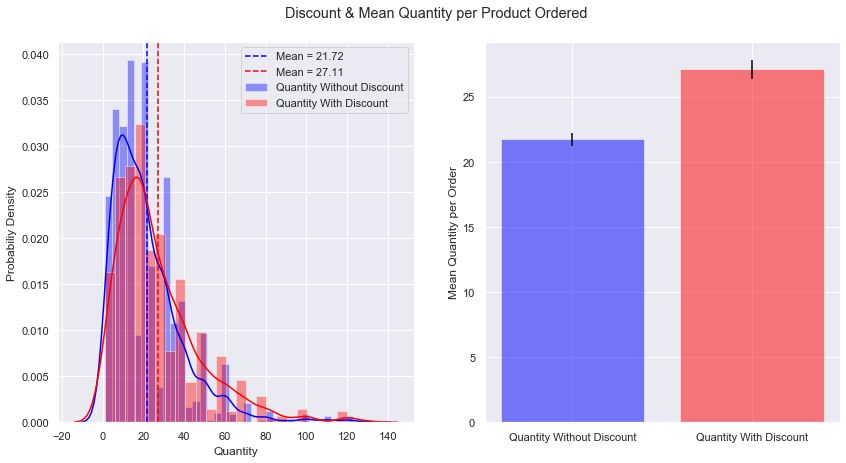


### Sub-Question 1a
What is the statistical power of this test?


```python
# First, must calculate cohen's d (effect size)

q1a_cd = Cohen_d(B1, A1)
print(q1a_cd)
```

    0.2862724481729282
    


```python
# Then, use statsmodels TTestIndPower class to help solve for power

power_analysis = TTestIndPower()
```


```python
# Solve for statistical power

alpha = 0.05
nobs1 = 838
nobs2 = 1317
ratio = nobs1 / nobs2

q1a_pow = power_analysis.solve_power(
    effect_size=q1a_cd, nobs1=nobs1, alpha=alpha, ratio=ratio)
print(
    f'The statistical power is {round(q1a_pow, 2)}, and the Type II (false negative) error rate for this test is {1 - round(q1a_pow, 2)}.')
```

    The statistical power is 1.0, and the Type II (false negative) error rate for this test is 0.0.
    

## Interpretation: Question 1a

A two-sample welch's t-test indicates that there is a statistically significant relationship between the presence of a discount and the quantity of a product in an order. Though neither group's sample distribution is normal, the large sample size in each group allows us to use the parametric 2-sample Welch's t-test. The difference between the mean quantities of the groups is ~ 5.5 items per product per order. At a Type I (false positive) error rate (alpha) of 0.05, the calculated Cohen's d effect size is relatively small (0.286), however, due to the large sample sizes, the statistical power is 1.0. Therefore, the Type II (false negative) error rate is effectively 0.

# Question # 1b: Level of Discount & Order Quantity
At what level(s) of discount is there a statistically significant effect on the quantity of a product in an order?

## Obtain


```python
# Obtain OrderDetail table, create a pandas dataframe for all entries

cur.execute("""SELECT * FROM OrderDetail;""")
q1bdf = pd.DataFrame(cur.fetchall())
q1bdf.columns = [x[0] for x in cur.description]
q1bdf.drop(labels='Id', inplace=True, axis=1)
q1bdf.tail()
```


<div>
<style scoped>
    .dataframe tbody tr th:only-of-type {
        vertical-align: middle;
    }

    .dataframe tbody tr th {
        vertical-align: top;
    }

    .dataframe thead th {
        text-align: right;
    }
</style>
<table border="1" class="dataframe">
  <thead>
    <tr style="text-align: right;">
      <th></th>
      <th>OrderId</th>
      <th>ProductId</th>
      <th>UnitPrice</th>
      <th>Quantity</th>
      <th>Discount</th>
    </tr>
  </thead>
  <tbody>
    <tr>
      <td>2150</td>
      <td>11077</td>
      <td>64</td>
      <td>33.25</td>
      <td>2</td>
      <td>0.03</td>
    </tr>
    <tr>
      <td>2151</td>
      <td>11077</td>
      <td>66</td>
      <td>17.00</td>
      <td>1</td>
      <td>0.00</td>
    </tr>
    <tr>
      <td>2152</td>
      <td>11077</td>
      <td>73</td>
      <td>15.00</td>
      <td>2</td>
      <td>0.01</td>
    </tr>
    <tr>
      <td>2153</td>
      <td>11077</td>
      <td>75</td>
      <td>7.75</td>
      <td>4</td>
      <td>0.00</td>
    </tr>
    <tr>
      <td>2154</td>
      <td>11077</td>
      <td>77</td>
      <td>13.00</td>
      <td>2</td>
      <td>0.00</td>
    </tr>
  </tbody>
</table>
</div>


## Test: Tukey's HSD Multiple Comparison

To compare the level at which a discount has a signficant effect on the quantity of a product ordered, I am using Tukey's honestly significant difference (HSD) test, a single step multiple comparison procedure. This is a post-hoc test to help determine WHICH discount levels have significantly different product order quantites (now that we know that a difference exists in order quantity between the 'discount' and 'no-discount' groups).


```python
q1b_result = sm.stats.multicomp.pairwise_tukeyhsd(
    endog=q1bdf.Quantity, groups=q1bdf.Discount)
```


```python
q1b_result.summary()
```


<table class="simpletable">
<caption>Multiple Comparison of Means - Tukey HSD, FWER=0.05</caption>
<tr>
  <th>group1</th> <th>group2</th> <th>meandiff</th>  <th>p-adj</th>   <th>lower</th>   <th>upper</th>  <th>reject</th>
</tr>
<tr>
    <td>0.0</td>   <td>0.01</td>  <td>-19.7153</td>   <td>0.9</td>  <td>-80.3306</td> <td>40.9001</td>  <td>False</td>
</tr>
<tr>
    <td>0.0</td>   <td>0.02</td>  <td>-19.7153</td>   <td>0.9</td>   <td>-62.593</td> <td>23.1625</td>  <td>False</td>
</tr>
<tr>
    <td>0.0</td>   <td>0.03</td>  <td>-20.0486</td>  <td>0.725</td> <td>-55.0714</td> <td>14.9742</td>  <td>False</td>
</tr>
<tr>
    <td>0.0</td>   <td>0.04</td>  <td>-20.7153</td>   <td>0.9</td>  <td>-81.3306</td> <td>39.9001</td>  <td>False</td>
</tr>
<tr>
    <td>0.0</td>   <td>0.05</td>   <td>6.2955</td>  <td>0.0011</td>  <td>1.5381</td>  <td>11.053</td>   <td>True</td> 
</tr>
<tr>
    <td>0.0</td>   <td>0.06</td>  <td>-19.7153</td>   <td>0.9</td>  <td>-80.3306</td> <td>40.9001</td>  <td>False</td>
</tr>
<tr>
    <td>0.0</td>    <td>0.1</td>   <td>3.5217</td>  <td>0.4269</td>  <td>-1.3783</td> <td>8.4217</td>   <td>False</td>
</tr>
<tr>
    <td>0.0</td>   <td>0.15</td>   <td>6.6669</td>  <td>0.0014</td>   <td>1.551</td>  <td>11.7828</td>  <td>True</td> 
</tr>
<tr>
    <td>0.0</td>    <td>0.2</td>   <td>5.3096</td>  <td>0.0303</td>  <td>0.2508</td>  <td>10.3684</td>  <td>True</td> 
</tr>
<tr>
    <td>0.0</td>   <td>0.25</td>    <td>6.525</td>  <td>0.0023</td>  <td>1.3647</td>  <td>11.6852</td>  <td>True</td> 
</tr>
<tr>
   <td>0.01</td>   <td>0.02</td>     <td>0.0</td>     <td>0.9</td>  <td>-74.2101</td> <td>74.2101</td>  <td>False</td>
</tr>
<tr>
   <td>0.01</td>   <td>0.03</td>   <td>-0.3333</td>   <td>0.9</td>  <td>-70.2993</td> <td>69.6326</td>  <td>False</td>
</tr>
<tr>
   <td>0.01</td>   <td>0.04</td>    <td>-1.0</td>     <td>0.9</td>  <td>-86.6905</td> <td>84.6905</td>  <td>False</td>
</tr>
<tr>
   <td>0.01</td>   <td>0.05</td>   <td>26.0108</td>   <td>0.9</td>   <td>-34.745</td> <td>86.7667</td>  <td>False</td>
</tr>
<tr>
   <td>0.01</td>   <td>0.06</td>     <td>0.0</td>     <td>0.9</td>  <td>-85.6905</td> <td>85.6905</td>  <td>False</td>
</tr>
<tr>
   <td>0.01</td>    <td>0.1</td>   <td>23.237</td>    <td>0.9</td>  <td>-37.5302</td> <td>84.0042</td>  <td>False</td>
</tr>
<tr>
   <td>0.01</td>   <td>0.15</td>   <td>26.3822</td>   <td>0.9</td>  <td>-34.4028</td> <td>87.1671</td>  <td>False</td>
</tr>
<tr>
   <td>0.01</td>    <td>0.2</td>   <td>25.0248</td>   <td>0.9</td>  <td>-35.7554</td> <td>85.805</td>   <td>False</td>
</tr>
<tr>
   <td>0.01</td>   <td>0.25</td>   <td>26.2403</td>   <td>0.9</td>  <td>-34.5485</td> <td>87.029</td>   <td>False</td>
</tr>
<tr>
   <td>0.02</td>   <td>0.03</td>   <td>-0.3333</td>   <td>0.9</td>  <td>-55.6463</td> <td>54.9796</td>  <td>False</td>
</tr>
<tr>
   <td>0.02</td>   <td>0.04</td>    <td>-1.0</td>     <td>0.9</td>  <td>-75.2101</td> <td>73.2101</td>  <td>False</td>
</tr>
<tr>
   <td>0.02</td>   <td>0.05</td>   <td>26.0108</td> <td>0.6622</td> <td>-17.0654</td> <td>69.087</td>   <td>False</td>
</tr>
<tr>
   <td>0.02</td>   <td>0.06</td>     <td>0.0</td>     <td>0.9</td>  <td>-74.2101</td> <td>74.2101</td>  <td>False</td>
</tr>
<tr>
   <td>0.02</td>    <td>0.1</td>   <td>23.237</td>  <td>0.7914</td> <td>-19.8552</td> <td>66.3292</td>  <td>False</td>
</tr>
<tr>
   <td>0.02</td>   <td>0.15</td>   <td>26.3822</td> <td>0.6461</td> <td>-16.7351</td> <td>69.4994</td>  <td>False</td>
</tr>
<tr>
   <td>0.02</td>    <td>0.2</td>   <td>25.0248</td> <td>0.7089</td> <td>-18.0857</td> <td>68.1354</td>  <td>False</td>
</tr>
<tr>
   <td>0.02</td>   <td>0.25</td>   <td>26.2403</td> <td>0.6528</td> <td>-16.8823</td> <td>69.3628</td>  <td>False</td>
</tr>
<tr>
   <td>0.03</td>   <td>0.04</td>   <td>-0.6667</td>   <td>0.9</td>  <td>-70.6326</td> <td>69.2993</td>  <td>False</td>
</tr>
<tr>
   <td>0.03</td>   <td>0.05</td>   <td>26.3441</td> <td>0.3639</td>  <td>-8.9214</td> <td>61.6096</td>  <td>False</td>
</tr>
<tr>
   <td>0.03</td>   <td>0.06</td>   <td>0.3333</td>    <td>0.9</td>  <td>-69.6326</td> <td>70.2993</td>  <td>False</td>
</tr>
<tr>
   <td>0.03</td>    <td>0.1</td>   <td>23.5703</td> <td>0.5338</td> <td>-11.7147</td> <td>58.8553</td>  <td>False</td>
</tr>
<tr>
   <td>0.03</td>   <td>0.15</td>   <td>26.7155</td> <td>0.3436</td>  <td>-8.6001</td> <td>62.0311</td>  <td>False</td>
</tr>
<tr>
   <td>0.03</td>    <td>0.2</td>   <td>25.3582</td>  <td>0.428</td>  <td>-9.9492</td> <td>60.6656</td>  <td>False</td>
</tr>
<tr>
   <td>0.03</td>   <td>0.25</td>   <td>26.5736</td> <td>0.3525</td>  <td>-8.7485</td> <td>61.8957</td>  <td>False</td>
</tr>
<tr>
   <td>0.04</td>   <td>0.05</td>   <td>27.0108</td>   <td>0.9</td>   <td>-33.745</td> <td>87.7667</td>  <td>False</td>
</tr>
<tr>
   <td>0.04</td>   <td>0.06</td>     <td>1.0</td>     <td>0.9</td>  <td>-84.6905</td> <td>86.6905</td>  <td>False</td>
</tr>
<tr>
   <td>0.04</td>    <td>0.1</td>   <td>24.237</td>    <td>0.9</td>  <td>-36.5302</td> <td>85.0042</td>  <td>False</td>
</tr>
<tr>
   <td>0.04</td>   <td>0.15</td>   <td>27.3822</td>   <td>0.9</td>  <td>-33.4028</td> <td>88.1671</td>  <td>False</td>
</tr>
<tr>
   <td>0.04</td>    <td>0.2</td>   <td>26.0248</td>   <td>0.9</td>  <td>-34.7554</td> <td>86.805</td>   <td>False</td>
</tr>
<tr>
   <td>0.04</td>   <td>0.25</td>   <td>27.2403</td>   <td>0.9</td>  <td>-33.5485</td> <td>88.029</td>   <td>False</td>
</tr>
<tr>
   <td>0.05</td>   <td>0.06</td>  <td>-26.0108</td>   <td>0.9</td>  <td>-86.7667</td> <td>34.745</td>   <td>False</td>
</tr>
<tr>
   <td>0.05</td>    <td>0.1</td>   <td>-2.7738</td>   <td>0.9</td>   <td>-9.1822</td> <td>3.6346</td>   <td>False</td>
</tr>
<tr>
   <td>0.05</td>   <td>0.15</td>   <td>0.3714</td>    <td>0.9</td>   <td>-6.2036</td> <td>6.9463</td>   <td>False</td>
</tr>
<tr>
   <td>0.05</td>    <td>0.2</td>   <td>-0.986</td>    <td>0.9</td>   <td>-7.5166</td> <td>5.5447</td>   <td>False</td>
</tr>
<tr>
   <td>0.05</td>   <td>0.25</td>   <td>0.2294</td>    <td>0.9</td>   <td>-6.3801</td>  <td>6.839</td>   <td>False</td>
</tr>
<tr>
   <td>0.06</td>    <td>0.1</td>   <td>23.237</td>    <td>0.9</td>  <td>-37.5302</td> <td>84.0042</td>  <td>False</td>
</tr>
<tr>
   <td>0.06</td>   <td>0.15</td>   <td>26.3822</td>   <td>0.9</td>  <td>-34.4028</td> <td>87.1671</td>  <td>False</td>
</tr>
<tr>
   <td>0.06</td>    <td>0.2</td>   <td>25.0248</td>   <td>0.9</td>  <td>-35.7554</td> <td>85.805</td>   <td>False</td>
</tr>
<tr>
   <td>0.06</td>   <td>0.25</td>   <td>26.2403</td>   <td>0.9</td>  <td>-34.5485</td> <td>87.029</td>   <td>False</td>
</tr>
<tr>
    <td>0.1</td>   <td>0.15</td>   <td>3.1452</td>    <td>0.9</td>   <td>-3.5337</td>  <td>9.824</td>   <td>False</td>
</tr>
<tr>
    <td>0.1</td>    <td>0.2</td>   <td>1.7879</td>    <td>0.9</td>   <td>-4.8474</td> <td>8.4231</td>   <td>False</td>
</tr>
<tr>
    <td>0.1</td>   <td>0.25</td>   <td>3.0033</td>    <td>0.9</td>   <td>-3.7096</td> <td>9.7161</td>   <td>False</td>
</tr>
<tr>
   <td>0.15</td>    <td>0.2</td>   <td>-1.3573</td>   <td>0.9</td>   <td>-8.1536</td> <td>5.4389</td>   <td>False</td>
</tr>
<tr>
   <td>0.15</td>   <td>0.25</td>   <td>-0.1419</td>   <td>0.9</td>   <td>-7.014</td>  <td>6.7302</td>   <td>False</td>
</tr>
<tr>
    <td>0.2</td>   <td>0.25</td>   <td>1.2154</td>    <td>0.9</td>   <td>-5.6143</td> <td>8.0451</td>   <td>False</td>
</tr>
</table>


## Interpretation: Question 1b

To compare the level at which a discount has a signficant effect on the quantity of a product ordered, I used Tukey's honestly significant difference (HSD) test, a single step multiple comparison procedure. The results of this test indicate that for most levels of discount 5% and above, we can reject the null hypothesis that there is no difference in quantity ordered between the means of the control (0% discount) group and experimental groups (any level of discount).

# Question # 2: Shipper & Freight Price
Question: (2) Does the shipper used have a statistically significant effect on the average freight cost for a shipment?

Null Hypothesis: Shipper has no significant effect on the freight cost for a shipment.

Alt. Hypothesis: There is a significant difference in freight cost between different shippers.

## Obtain

Load both Shipper and Order tables from SQL database


```python
# Get Shipper table from database

cur.execute("""SELECT * 
            FROM Shipper;""")
shipper_df = pd.DataFrame(cur.fetchall())
shipper_df.columns = [x[0] for x in cur.description]
shipper_df.head()
```


<div>
<style scoped>
    .dataframe tbody tr th:only-of-type {
        vertical-align: middle;
    }

    .dataframe tbody tr th {
        vertical-align: top;
    }

    .dataframe thead th {
        text-align: right;
    }
</style>
<table border="1" class="dataframe">
  <thead>
    <tr style="text-align: right;">
      <th></th>
      <th>Id</th>
      <th>CompanyName</th>
      <th>Phone</th>
    </tr>
  </thead>
  <tbody>
    <tr>
      <td>0</td>
      <td>1</td>
      <td>Speedy Express</td>
      <td>(503) 555-9831</td>
    </tr>
    <tr>
      <td>1</td>
      <td>2</td>
      <td>United Package</td>
      <td>(503) 555-3199</td>
    </tr>
    <tr>
      <td>2</td>
      <td>3</td>
      <td>Federal Shipping</td>
      <td>(503) 555-9931</td>
    </tr>
  </tbody>
</table>
</div>


```python
# Get Order table from database

cur.execute("""SELECT * 
            FROM 'Order';""")
order_df = pd.DataFrame(cur.fetchall())
order_df.columns = [x[0] for x in cur.description]
order_df.head()
```


<div>
<style scoped>
    .dataframe tbody tr th:only-of-type {
        vertical-align: middle;
    }

    .dataframe tbody tr th {
        vertical-align: top;
    }

    .dataframe thead th {
        text-align: right;
    }
</style>
<table border="1" class="dataframe">
  <thead>
    <tr style="text-align: right;">
      <th></th>
      <th>Id</th>
      <th>CustomerId</th>
      <th>EmployeeId</th>
      <th>OrderDate</th>
      <th>RequiredDate</th>
      <th>ShippedDate</th>
      <th>ShipVia</th>
      <th>Freight</th>
      <th>ShipName</th>
      <th>ShipAddress</th>
      <th>ShipCity</th>
      <th>ShipRegion</th>
      <th>ShipPostalCode</th>
      <th>ShipCountry</th>
    </tr>
  </thead>
  <tbody>
    <tr>
      <td>0</td>
      <td>10248</td>
      <td>VINET</td>
      <td>5</td>
      <td>2012-07-04</td>
      <td>2012-08-01</td>
      <td>2012-07-16</td>
      <td>3</td>
      <td>32.38</td>
      <td>Vins et alcools Chevalier</td>
      <td>59 rue de l'Abbaye</td>
      <td>Reims</td>
      <td>Western Europe</td>
      <td>51100</td>
      <td>France</td>
    </tr>
    <tr>
      <td>1</td>
      <td>10249</td>
      <td>TOMSP</td>
      <td>6</td>
      <td>2012-07-05</td>
      <td>2012-08-16</td>
      <td>2012-07-10</td>
      <td>1</td>
      <td>11.61</td>
      <td>Toms Spezialitäten</td>
      <td>Luisenstr. 48</td>
      <td>Münster</td>
      <td>Western Europe</td>
      <td>44087</td>
      <td>Germany</td>
    </tr>
    <tr>
      <td>2</td>
      <td>10250</td>
      <td>HANAR</td>
      <td>4</td>
      <td>2012-07-08</td>
      <td>2012-08-05</td>
      <td>2012-07-12</td>
      <td>2</td>
      <td>65.83</td>
      <td>Hanari Carnes</td>
      <td>Rua do Paço, 67</td>
      <td>Rio de Janeiro</td>
      <td>South America</td>
      <td>05454-876</td>
      <td>Brazil</td>
    </tr>
    <tr>
      <td>3</td>
      <td>10251</td>
      <td>VICTE</td>
      <td>3</td>
      <td>2012-07-08</td>
      <td>2012-08-05</td>
      <td>2012-07-15</td>
      <td>1</td>
      <td>41.34</td>
      <td>Victuailles en stock</td>
      <td>2, rue du Commerce</td>
      <td>Lyon</td>
      <td>Western Europe</td>
      <td>69004</td>
      <td>France</td>
    </tr>
    <tr>
      <td>4</td>
      <td>10252</td>
      <td>SUPRD</td>
      <td>4</td>
      <td>2012-07-09</td>
      <td>2012-08-06</td>
      <td>2012-07-11</td>
      <td>2</td>
      <td>51.30</td>
      <td>Suprêmes délices</td>
      <td>Boulevard Tirou, 255</td>
      <td>Charleroi</td>
      <td>Western Europe</td>
      <td>B-6000</td>
      <td>Belgium</td>
    </tr>
  </tbody>
</table>
</div>


## Scrub / Explore

Subsetting Orders table by shipper used (ShipVia == 1, 2, OR 3)


```python
cur.execute("""
            SELECT CompanyName, ShipVia, Freight
            FROM 'Order' o
            JOIN Shipper s
            ON s.Id = o.ShipVia
            WHERE ShipVia == 1;""")
s1_df = pd.DataFrame(cur.fetchall())
s1_df.columns = [x[0] for x in cur.description]
s1_df.head()

cur.execute("""
            SELECT CompanyName, ShipVia, Freight
            FROM 'Order' o
            JOIN Shipper s
            ON s.Id = o.ShipVia
            WHERE ShipVia == 2;""")
s2_df = pd.DataFrame(cur.fetchall())
s2_df.columns = [x[0] for x in cur.description]
s2_df.head()

cur.execute("""
            SELECT CompanyName, ShipVia, Freight
            FROM 'Order' o
            JOIN Shipper s
            ON s.Id = o.ShipVia
            WHERE ShipVia == 3;""")
s3_df = pd.DataFrame(cur.fetchall())
s3_df.columns = [x[0] for x in cur.description]
s3_df.head()
```


<div>
<style scoped>
    .dataframe tbody tr th:only-of-type {
        vertical-align: middle;
    }

    .dataframe tbody tr th {
        vertical-align: top;
    }

    .dataframe thead th {
        text-align: right;
    }
</style>
<table border="1" class="dataframe">
  <thead>
    <tr style="text-align: right;">
      <th></th>
      <th>CompanyName</th>
      <th>ShipVia</th>
      <th>Freight</th>
    </tr>
  </thead>
  <tbody>
    <tr>
      <td>0</td>
      <td>Federal Shipping</td>
      <td>3</td>
      <td>32.38</td>
    </tr>
    <tr>
      <td>1</td>
      <td>Federal Shipping</td>
      <td>3</td>
      <td>148.33</td>
    </tr>
    <tr>
      <td>2</td>
      <td>Federal Shipping</td>
      <td>3</td>
      <td>81.91</td>
    </tr>
    <tr>
      <td>3</td>
      <td>Federal Shipping</td>
      <td>3</td>
      <td>3.25</td>
    </tr>
    <tr>
      <td>4</td>
      <td>Federal Shipping</td>
      <td>3</td>
      <td>48.29</td>
    </tr>
  </tbody>
</table>
</div>


```python
# For loop to generate the freight price datasets for each shipper

shippers = [s1_df, s2_df, s3_df]
freight_dists = []
for df in shippers:
    freight_dists.append(df.Freight)

print(freight_dists)
```

    [0       11.61
    1       41.34
    2      140.51
    3       55.09
    4       55.28
            ...  
    244      0.33
    245     30.09
    246     12.91
    247    136.00
    248      0.93
    Name: Freight, Length: 249, dtype: float64, 0      65.83
    1      51.30
    2      58.17
    3      22.98
    4      13.97
           ...  
    321    24.95
    322    18.44
    323     6.19
    324    38.28
    325     8.53
    Name: Freight, Length: 326, dtype: float64, 0       32.38
    1      148.33
    2       81.91
    3        3.25
    4       48.29
            ...  
    250     24.12
    251      2.79
    252      4.13
    253     31.14
    254     14.01
    Name: Freight, Length: 255, dtype: float64]
    


```python
# Use DistChecker class to check normality/characteristics of distributions and select a test

shipper_num = 0
for i in freight_dists:
    shipper_num += 1
    dist = DistChecker(i, f'Shipper {shipper_num}')
    dist.plot_dist()
    dist.summary_info()
    dist.norm_tests()
```


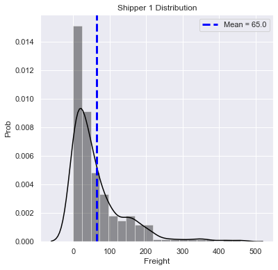


    Shipper 1 distribution summary statistics:
    
     count    249.000000
    mean      65.001325
    std       75.393587
    min        0.120000
    25%       12.750000
    50%       40.420000
    75%       89.900000
    max      458.780000
    Name: Freight, dtype: float64
    
    
    Shipper 1 distribution value counts:
    
     12.69     2
    1.36      2
    188.04    1
    63.20     1
    69.19     1
             ..
    10.19     1
    38.06     1
    2.91      1
    200.24    1
    12.75     1
    Name: Freight, Length: 247, dtype: int64
    SHAPIRO-WILK TEST at alpha = 0.05:
    The null hypothesis that sample was drawn from a normal distribution is REJECTED at p = 2.024363869389547e-18
    
    D'AGOSTINO-PEARSON TEST at alpha = 0.05:
    The null hypothesis that sample was drawn from a normal distribution is REJECTED at p = 2.1898236398446387e-28
    
    ANDERSON-DARLING TEST at alpha = 0.05:
    The null hypothesis that sample was drawn from a normal distribution is REJECTED.
    Test Statistic: 15.953834477999408 > Critical Value 0.775
    


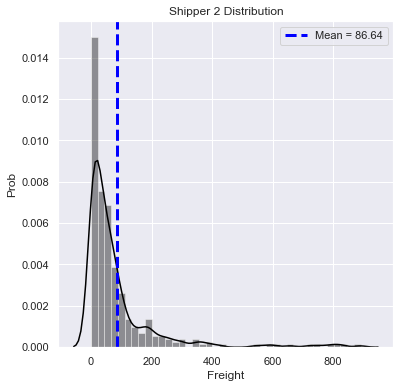


    Shipper 2 distribution summary statistics:
    
     count    326.000000
    mean      86.640644
    std      138.219262
    min        0.020000
    25%       14.040000
    50%       44.135000
    75%       91.430000
    max      890.780000
    Name: Freight, dtype: float64
    
    
    Shipper 2 distribution value counts:
    
     3.26      2
    23.72     2
    0.56      2
    1.35      2
    6.27      2
             ..
    3.05      1
    60.43     1
    1.15      1
    156.66    1
    22.00     1
    Name: Freight, Length: 319, dtype: int64
    SHAPIRO-WILK TEST at alpha = 0.05:
    The null hypothesis that sample was drawn from a normal distribution is REJECTED at p = 2.954606683318374e-27
    
    D'AGOSTINO-PEARSON TEST at alpha = 0.05:
    The null hypothesis that sample was drawn from a normal distribution is REJECTED at p = 1.1480923009081493e-57
    
    ANDERSON-DARLING TEST at alpha = 0.05:
    The null hypothesis that sample was drawn from a normal distribution is REJECTED.
    Test Statistic: 40.34253113699663 > Critical Value 0.778
    


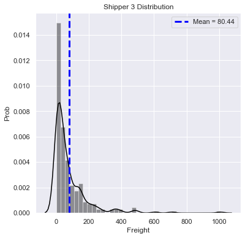


    Shipper 3 distribution summary statistics:
    
     count     255.000000
    mean       80.441216
    std       119.362844
    min         0.400000
    25%        12.860000
    50%        36.710000
    75%        99.490000
    max      1007.640000
    Name: Freight, dtype: float64
    
    
    Shipper 3 distribution value counts:
    
     32.01     1
    4.07      1
    13.99     1
    8.85      1
    144.38    1
             ..
    145.04    1
    29.78     1
    4.32      1
    229.24    1
    3.25      1
    Name: Freight, Length: 255, dtype: int64
    SHAPIRO-WILK TEST at alpha = 0.05:
    The null hypothesis that sample was drawn from a normal distribution is REJECTED at p = 3.371958171463351e-23
    
    D'AGOSTINO-PEARSON TEST at alpha = 0.05:
    The null hypothesis that sample was drawn from a normal distribution is REJECTED at p = 2.1224208469747222e-50
    
    ANDERSON-DARLING TEST at alpha = 0.05:
    The null hypothesis that sample was drawn from a normal distribution is REJECTED.
    Test Statistic: 25.26923529014107 > Critical Value 0.775
    

The data are not normally distributed, but it appears that each sample would benefit from outlier removal.


```python
# Peform IQR score outlier removal on datasets

out_rem_data = []

for i in freight_dists:
    q1, q3 = np.percentile(a=i, q=[25, 75])
    iqr = q3 - q1
    lower_bound = q1 - (1.5*iqr)
    upper_bound = q3 + (1.5*iqr)
    fr_out = i.to_list()
    for obs in fr_out:
        if obs < lower_bound or obs > upper_bound:
            fr_out.remove(obs)
        else:
            continue
    out_rem_data.append(fr_out)

out_rem_data
```


    [[11.61,
      41.34,
      140.51,
      55.09,
      55.28,
      4.56,
      136.54,
      6.01,
      26.93,
      8.98,
      2.94,
      12.69,
      76.56,
      7.45,
      79.7,
      0.12,
      47.3,
      12.69,
      4.88,
      63.36,
      12.75,
      10.19,
      110.37,
      8.63,
      162.33,
      41.95,
      19.64,
      96.04,
      71.97,
      0.45,
      45.03,
      94.77,
      34.86,
      126.38,
      184.41,
      60.26,
      12.51,
      155.97,
      34.82,
      108.04,
      11.26,
      29.83,
      0.2,
      17.55,
      44.12,
      99.23,
      3.02,
      18.69,
      11.09,
      19.97,
      13.95,
      9.3,
      14.68,
      140.26,
      11.57,
      16.27,
      6.17,
      11.93,
      60.18,
      4.2,
      68.52,
      62.89,
      36.21,
      42.68,
      69.32,
      47.45,
      0.15,
      105.65,
      204.47,
      13.37,
      45.33,
      41.9,
      8.12,
      188.04,
      15.64,
      78.85,
      68.65,
      24.91,
      171.24,
      83.22,
      9.8,
      8.05,
      36.65,
      22.95,
      88.4,
      33.97,
      58.98,
      127.34,
      3.01,
      59.14,
      13.41,
      0.48,
      62.52,
      55.92,
      32.1,
      96.78,
      16.34,
      45.13,
      58.3,
      7.46,
      200.24,
      26.78,
      154.68,
      43.9,
      0.87,
      41.38,
      1.15,
      201.29,
      158.44,
      23.55,
      29.46,
      12.41,
      93.25,
      55.26,
      57.15,
      111.29,
      78.09,
      24.39,
      203.48,
      30.34,
      22.76,
      26.61,
      4.4,
      145.63,
      96.5,
      15.8,
      16.72,
      45.52,
      65.1,
      23.94,
      4.78,
      4.98,
      89.93,
      167.05,
      63.2,
      74.58,
      21.72,
      16.56,
      89.9,
      20.12,
      96.65,
      16.97,
      2.91,
      69.19,
      3.52,
      117.33,
      79.3,
      7.7,
      8.19,
      155.64,
      157.55,
      65.06,
      48.2,
      20.25,
      6.79,
      42.13,
      110.87,
      28.23,
      21.49,
      26.52,
      2.33,
      55.23,
      1.36,
      4.87,
      31.22,
      59.78,
      47.38,
      36.68,
      1.23,
      79.25,
      7.09,
      90.85,
      154.72,
      212.98,
      49.19,
      160.55,
      174.05,
      170.97,
      52.51,
      109.11,
      1.93,
      143.28,
      0.82,
      38.06,
      46.69,
      88.01,
      2.84,
      4.99,
      32.76,
      116.13,
      162.75,
      62.09,
      44.15,
      38.19,
      33.05,
      21.19,
      176.48,
      2.27,
      19.79,
      1.36,
      33.93,
      134.64,
      10.22,
      40.42,
      27.91,
      2.08,
      104.47,
      27.19,
      16.16,
      37.97,
      1.26,
      14.01,
      91.51,
      185.48,
      34.76,
      38.51,
      141.16,
      44.84,
      0.75,
      59.11,
      1.21,
      32.99,
      74.36,
      47.09,
      52.52,
      29.59,
      47.84,
      40.32,
      3.2,
      29.99,
      8.72,
      8.34,
      67.26,
      0.33,
      30.09,
      12.91,
      136.0,
      0.93],
     [65.83,
      51.3,
      58.17,
      22.98,
      13.97,
      3.05,
      4.54,
      98.03,
      92.69,
      25.83,
      76.83,
      6.4,
      1.35,
      147.26,
      1.15,
      5.74,
      168.22,
      29.76,
      17.68,
      45.08,
      6.27,
      107.83,
      63.79,
      0.56,
      17.52,
      40.26,
      1.96,
      74.16,
      41.76,
      4.73,
      3.43,
      77.92,
      191.67,
      52.84,
      8.56,
      42.11,
      15.51,
      15.66,
      54.83,
      23.29,
      0.78,
      64.19,
      36.71,
      183.17,
      22.0,
      10.14,
      101.95,
      195.68,
      1.17,
      20.12,
      20.39,
      30.96,
      93.63,
      47.42,
      67.88,
      91.48,
      3.77,
      95.66,
      137.35,
      7.93,
      31.29,
      56.63,
      44.17,
      4.34,
      17.92,
      9.21,
      156.66,
      8.24,
      86.53,
      73.02,
      47.94,
      68.66,
      38.82,
      53.3,
      7.23,
      25.36,
      180.45,
      8.12,
      25.09,
      89.0,
      4.93,
      64.56,
      83.49,
      13.02,
      1.35,
      64.33,
      15.28,
      64.45,
      30.53,
      71.07,
      4.93,
      5.29,
      65.99,
      46.77,
      29.75,
      102.02,
      16.74,
      21.19,
      4.99,
      3.53,
      218.15,
      17.22,
      77.63,
      11.06,
      58.59,
      3.35,
      66.69,
      27.94,
      58.88,
      48.17,
      11.92,
      178.43,
      1.43,
      149.49,
      96.72,
      72.97,
      60.43,
      7.15,
      116.43,
      37.6,
      25.41,
      13.73,
      27.71,
      7.28,
      4.42,
      174.2,
      5.24,
      2.92,
      48.77,
      27.79,
      1.85,
      80.65,
      8.11,
      116.53,
      18.53,
      23.73,
      97.18,
      94.8,
      138.69,
      32.35,
      179.61,
      0.14,
      45.54,
      14.25,
      20.6,
      7.14,
      4.41,
      105.81,
      1.28,
      113.15,
      26.31,
      47.22,
      95.75,
      0.9,
      31.85,
      2.01,
      36.13,
      33.75,
      299.09,
      13.42,
      61.02,
      152.3,
      3.52,
      2.96,
      52.41,
      22.57,
      59.25,
      51.44,
      9.53,
      57.75,
      58.33,
      45.97,
      44.1,
      7.79,
      81.88,
      23.72,
      61.53,
      16.71,
      73.21,
      18.66,
      146.32,
      11.19,
      91.28,
      3.01,
      58.13,
      124.98,
      42.7,
      100.6,
      16.85,
      126.66,
      33.35,
      97.09,
      27.33,
      22.11,
      306.07,
      37.52,
      163.97,
      63.54,
      81.83,
      72.19,
      43.26,
      71.49,
      2.71,
      9.26,
      25.22,
      38.24,
      0.56,
      53.83,
      100.22,
      58.43,
      188.85,
      76.1,
      14.93,
      53.23,
      30.26,
      3.04,
      191.27,
      112.27,
      175.32,
      19.58,
      32.37,
      90.97,
      51.87,
      20.37,
      120.27,
      77.78,
      1.27,
      1.66,
      13.72,
      32.96,
      53.05,
      3.51,
      63.77,
      8.29,
      19.8,
      29.61,
      151.52,
      13.6,
      33.68,
      31.89,
      76.33,
      2.17,
      27.2,
      3.26,
      2.5,
      30.85,
      23.72,
      3.26,
      44.65,
      49.56,
      4.98,
      87.38,
      62.22,
      0.21,
      121.82,
      0.02,
      15.17,
      32.82,
      193.37,
      217.86,
      61.14,
      1.12,
      73.91,
      20.31,
      96.35,
      197.3,
      25.19,
      202.24,
      28.71,
      4.62,
      33.8,
      11.65,
      43.3,
      6.27,
      123.83,
      227.22,
      0.17,
      29.59,
      65.0,
      48.22,
      8.8,
      70.58,
      71.64,
      59.41,
      53.05,
      120.92,
      85.8,
      10.98,
      29.93,
      81.73,
      44.72,
      7.98,
      81.75,
      15.67,
      24.95,
      18.44,
      6.19,
      38.28,
      8.53],
     [32.38,
      148.33,
      81.91,
      3.25,
      48.29,
      146.06,
      3.67,
      25.73,
      66.29,
      76.07,
      13.84,
      125.77,
      84.81,
      229.24,
      12.76,
      22.77,
      21.18,
      7.56,
      1.61,
      24.69,
      150.15,
      64.5,
      34.57,
      0.4,
      64.86,
      87.03,
      0.59,
      108.26,
      84.21,
      166.31,
      26.78,
      142.08,
      3.1,
      1.3,
      53.8,
      34.88,
      131.7,
      30.54,
      13.55,
      124.12,
      3.94,
      22.21,
      5.44,
      35.03,
      7.99,
      34.24,
      168.64,
      13.99,
      5.45,
      122.46,
      126.56,
      30.34,
      135.35,
      89.16,
      27.36,
      83.93,
      73.79,
      2.4,
      23.65,
      21.48,
      22.72,
      70.29,
      24.5,
      73.83,
      4.07,
      3.5,
      189.09,
      2.74,
      147.06,
      148.61,
      14.78,
      145.04,
      44.12,
      45.59,
      16.37,
      4.41,
      4.81,
      7.48,
      6.88,
      16.96,
      10.64,
      4.65,
      8.85,
      59.13,
      7.13,
      350.64,
      62.78,
      32.07,
      91.76,
      74.46,
      4.87,
      12.36,
      10.95,
      194.72,
      4.32,
      72.95,
      120.97,
      13.75,
      6.54,
      188.99,
      26.06,
      84.84,
      18.56,
      29.6,
      75.89,
      194.67,
      44.77,
      35.12,
      44.42,
      29.98,
      79.4,
      1.93,
      0.75,
      91.05,
      0.94,
      50.97,
      107.46,
      30.36,
      85.46,
      487.38,
      47.46,
      38.64,
      41.89,
      142.33,
      6.2,
      176.81,
      17.55,
      1.27,
      4.03,
      27.94,
      76.13,
      139.34,
      102.55,
      0.58,
      220.31,
      135.63,
      21.74,
      210.8,
      24.49,
      170.88,
      48.92,
      10.83,
      141.06,
      110.11,
      1.63,
      11.08,
      10.96,
      31.43,
      130.79,
      1.39,
      2.38,
      138.17,
      11.99,
      37.35,
      145.45,
      42.74,
      1.59,
      5.32,
      96.43,
      73.16,
      1.1,
      70.09,
      1.51,
      23.79,
      4.52,
      30.76,
      137.44,
      45.53,
      4.33,
      130.94,
      14.62,
      65.48,
      19.76,
      7.0,
      29.78,
      69.53,
      13.32,
      59.28,
      35.43,
      54.42,
      56.46,
      19.26,
      12.04,
      60.42,
      8.5,
      23.1,
      0.53,
      5.64,
      1.25,
      32.45,
      1.21,
      36.71,
      162.95,
      26.29,
      9.19,
      38.11,
      48.83,
      62.74,
      68.26,
      39.92,
      15.55,
      54.15,
      32.01,
      47.59,
      31.51,
      19.77,
      17.95,
      52.92,
      23.39,
      74.44,
      105.36,
      2.7,
      144.38,
      74.6,
      12.96,
      32.27,
      208.5,
      211.22,
      117.61,
      4.27,
      8.81,
      65.53,
      46.0,
      55.12,
      14.91,
      79.46,
      23.6,
      3.17,
      29.17,
      84.74,
      149.47,
      18.84,
      46.62,
      24.12,
      2.79,
      4.13,
      31.14,
      14.01]]


```python
# Use DistChecker class to check normality/characteristics of data after outlier removal

shipper_num = 0
for i in out_rem_data:
    shipper_num += 1
    dist = DistChecker(i, f'Shipper {shipper_num}')
    dist.plot_dist()
    dist.norm_tests()
    print(f'\n{len(i)} observations in Shipper {shipper_num}')
```


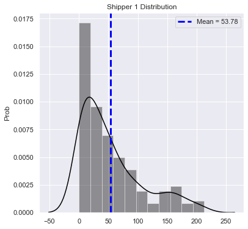


    SHAPIRO-WILK TEST at alpha = 0.05:
    The null hypothesis that sample was drawn from a normal distribution is REJECTED at p = 2.7612072987770984e-14
    
    D'AGOSTINO-PEARSON TEST at alpha = 0.05:
    The null hypothesis that sample was drawn from a normal distribution is REJECTED at p = 4.1698969876157934e-10
    
    ANDERSON-DARLING TEST at alpha = 0.05:
    The null hypothesis that sample was drawn from a normal distribution is REJECTED.
    Test Statistic: 11.402229551826736 > Critical Value 0.774
    
    238 observations in Shipper 1
    


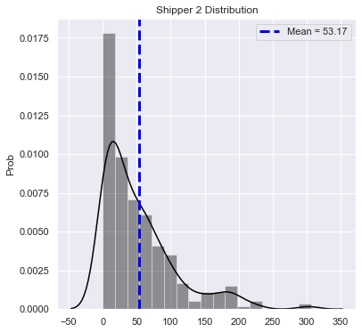


    SHAPIRO-WILK TEST at alpha = 0.05:
    The null hypothesis that sample was drawn from a normal distribution is REJECTED at p = 1.8585742512441667e-17
    
    D'AGOSTINO-PEARSON TEST at alpha = 0.05:
    The null hypothesis that sample was drawn from a normal distribution is REJECTED at p = 3.6148874537385146e-23
    
    ANDERSON-DARLING TEST at alpha = 0.05:
    The null hypothesis that sample was drawn from a normal distribution is REJECTED.
    Test Statistic: 13.978704935030635 > Critical Value 0.777
    
    299 observations in Shipper 2
    


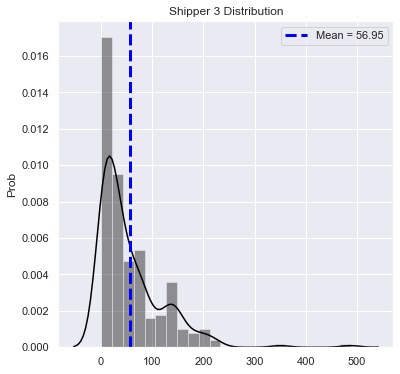


    SHAPIRO-WILK TEST at alpha = 0.05:
    The null hypothesis that sample was drawn from a normal distribution is REJECTED at p = 1.1838197818094493e-17
    
    D'AGOSTINO-PEARSON TEST at alpha = 0.05:
    The null hypothesis that sample was drawn from a normal distribution is REJECTED at p = 1.2181893996358094e-31
    
    ANDERSON-DARLING TEST at alpha = 0.05:
    The null hypothesis that sample was drawn from a normal distribution is REJECTED.
    Test Statistic: 13.209254925836234 > Critical Value 0.774
    
    238 observations in Shipper 3
    

Do these data meet the requirements for a one-way ANOVA test?

1) Is each record in data distinct and independent? -> Yes

2) Are samples normally distriuted, or is N >= 25? -> Yes

3) Is homogeneity of variance present? (Only needed for sharply unequal sample sizes) -> No (But sample sizes are not 'SHARPLY' unequal (238 vs 299 vs 238), so this assumption is met.)

Therefore, I conclude that the one-way ANOVA is suitable for these samples, but I will also perform a Kruskal-Wallis test as a non-parametric check.

## Test: One-Way ANOVA (Kruskal-Wallis)


```python
f_st, p_val = stats.f_oneway(out_rem_data[0], out_rem_data[1], out_rem_data[2])
alpha = 0.05
if p_val < 0.05:
    print('ONE-WAY ANOVA TEST RESULT:\n')
    print(
        f'The null hypothesis IS rejected at alpha={alpha}, with a p-value of {round(p_val,3)}')
else:
    print('ONE-WAY ANOVA TEST RESULT:\n')
    print(
        f'The null hypothesis is NOT rejected at alpha={alpha}, with a p-value of {round(p_val,3)}')
```

    ONE-WAY ANOVA TEST RESULT:
    
    The null hypothesis is NOT rejected at alpha=0.05, with a p-value of 0.728
    


```python
st, p_val = stats.kruskal(out_rem_data[0], out_rem_data[1], out_rem_data[2])
alpha = 0.05
if p_val < 0.05:
    print('KRUSKAL-WALLIS TEST RESULT:\n')
    print(
        f'The null hypothesis IS rejected at alpha={alpha}, with a p-value of {round(p_val,3)}')
else:
    print('KRUSKAL-WALLIS TEST RESULT:\n')
    print(
        f'The null hypothesis is NOT rejected at alpha={alpha}, with a p-value of {round(p_val,3)}')
```

    KRUSKAL-WALLIS TEST RESULT:
    
    The null hypothesis is NOT rejected at alpha=0.05, with a p-value of 0.991
    


```python
# Creating dictionary of data for plotting

names = ['Speedy Express', 'United Package', 'Federal Shipping']
q2_data = dict(zip(names, out_rem_data))
```


```python
# Plot bar chart comparing sample means of shippers

plt.figure(figsize=(14, 8))

plt.subplot(121)
for k, v in q2_data.items():
    plt.bar(x=k, height=np.mean(v), yerr=stats.sem(
        v), linewidth=1, edgecolor='black')
plt.ylabel('Mean Freight Price ($)', labelpad=20)

plt.subplot(122)
sns.boxplot(data=out_rem_data)
plt.rcParams.update({'font.size': 16})
plt.xticks(ticks=[0, 1, 2], labels=names)

plt.suptitle('Shipper & Freight Price', y=0.95)

plt.show()
```


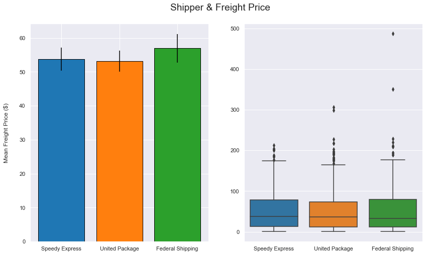


## Interpretation: Question 2

To test the hypothesis that there is no significant difference in freight price between shippers, I used a one-way ANOVA test, a parametric test used to compare means of two or more samples. I attempted outlier removal in an attempt to remove the bias of very expensive shipments. While the sample data were not normally distributed, the size of each sample was large enough to ignore this assumption for one-way ANOVA. Also, since the sample sizes were not 'sharply' different, the homogeneity of variance assumption for one-way ANOVA could also be ignored.

The results of this test indicate that, at alpha = 0.05, we cannot reject the null hypothesis that there is no signficant difference in freight prices between shippers.

The result of a non-parametric Krustal-Wallis test on the same samples confirms this result.

# Question # 3: Employee & Orders per Customer
Question (3) Does the specific employee have a statistically significant effect on the number of repeat orders their customers make?

Null Hypothesis: The specific employee has no statistically signficant effect on the number of repeat orders a customer makes.

Alternative Hypothesis: The specific employee has a signficant impact on the number of repeat orders a customer makes.

## Obtain
Need info from Order table


```python
cur.execute("""SELECT CustomerId, EmployeeId
            FROM 'Order'
            ;""")
q3df = pd.DataFrame(cur.fetchall())
q3df.columns = [x[0] for x in cur.description]
q3df
```


<div>
<style scoped>
    .dataframe tbody tr th:only-of-type {
        vertical-align: middle;
    }

    .dataframe tbody tr th {
        vertical-align: top;
    }

    .dataframe thead th {
        text-align: right;
    }
</style>
<table border="1" class="dataframe">
  <thead>
    <tr style="text-align: right;">
      <th></th>
      <th>CustomerId</th>
      <th>EmployeeId</th>
    </tr>
  </thead>
  <tbody>
    <tr>
      <td>0</td>
      <td>VINET</td>
      <td>5</td>
    </tr>
    <tr>
      <td>1</td>
      <td>TOMSP</td>
      <td>6</td>
    </tr>
    <tr>
      <td>2</td>
      <td>HANAR</td>
      <td>4</td>
    </tr>
    <tr>
      <td>3</td>
      <td>VICTE</td>
      <td>3</td>
    </tr>
    <tr>
      <td>4</td>
      <td>SUPRD</td>
      <td>4</td>
    </tr>
    <tr>
      <td>...</td>
      <td>...</td>
      <td>...</td>
    </tr>
    <tr>
      <td>825</td>
      <td>PERIC</td>
      <td>2</td>
    </tr>
    <tr>
      <td>826</td>
      <td>SIMOB</td>
      <td>7</td>
    </tr>
    <tr>
      <td>827</td>
      <td>RICSU</td>
      <td>8</td>
    </tr>
    <tr>
      <td>828</td>
      <td>BONAP</td>
      <td>4</td>
    </tr>
    <tr>
      <td>829</td>
      <td>RATTC</td>
      <td>1</td>
    </tr>
  </tbody>
</table>
<p>830 rows × 2 columns</p>
</div>


## Scrub / Explore
Grouping data by EmployeeID and then by CustomerId, and totaling the number of orders each customer has made.


```python
# Calculate number of orders each customer has made with each unique employee

cust_ord_by_emp = q3df.groupby(['EmployeeId', 'CustomerId'])[
    'CustomerId'].count()
df = cust_ord_by_emp.to_frame()
df
```


<div>
<style scoped>
    .dataframe tbody tr th:only-of-type {
        vertical-align: middle;
    }

    .dataframe tbody tr th {
        vertical-align: top;
    }

    .dataframe thead th {
        text-align: right;
    }
</style>
<table border="1" class="dataframe">
  <thead>
    <tr style="text-align: right;">
      <th></th>
      <th></th>
      <th>CustomerId</th>
    </tr>
    <tr>
      <th>EmployeeId</th>
      <th>CustomerId</th>
      <th></th>
    </tr>
  </thead>
  <tbody>
    <tr>
      <td rowspan="5" valign="top">1</td>
      <td>ALFKI</td>
      <td>2</td>
    </tr>
    <tr>
      <td>ANTO</td>
      <td>1</td>
    </tr>
    <tr>
      <td>AROUT</td>
      <td>3</td>
    </tr>
    <tr>
      <td>BERGS</td>
      <td>4</td>
    </tr>
    <tr>
      <td>BONAP</td>
      <td>3</td>
    </tr>
    <tr>
      <td>...</td>
      <td>...</td>
      <td>...</td>
    </tr>
    <tr>
      <td rowspan="5" valign="top">9</td>
      <td>SAVEA</td>
      <td>1</td>
    </tr>
    <tr>
      <td>SUPRD</td>
      <td>1</td>
    </tr>
    <tr>
      <td>TRAIH</td>
      <td>1</td>
    </tr>
    <tr>
      <td>WARTH</td>
      <td>1</td>
    </tr>
    <tr>
      <td>WELLI</td>
      <td>1</td>
    </tr>
  </tbody>
</table>
<p>464 rows × 1 columns</p>
</div>


```python
# Create dictionary for number of times customers returned for each employee
rc_dict = {}

for i in range(1, 10):
    key = f'Employee {i}'
    vals = cust_ord_by_emp.loc[i].to_list()
    rc_dict[key] = vals

rc_dict
```


    {'Employee 1': [2,
      1,
      3,
      4,
      3,
      2,
      1,
      1,
      1,
      2,
      1,
      2,
      5,
      1,
      1,
      5,
      1,
      1,
      2,
      1,
      1,
      1,
      1,
      1,
      3,
      2,
      1,
      1,
      1,
      4,
      1,
      1,
      1,
      3,
      2,
      1,
      2,
      3,
      1,
      1,
      1,
      1,
      4,
      1,
      5,
      2,
      2,
      1,
      1,
      2,
      6,
      2,
      2,
      1,
      1,
      4,
      2,
      4,
      2,
      1,
      1,
      1,
      1,
      1,
      2],
     'Employee 2': [1,
      1,
      1,
      2,
      1,
      1,
      1,
      1,
      1,
      3,
      1,
      3,
      1,
      2,
      1,
      1,
      1,
      1,
      3,
      1,
      2,
      1,
      2,
      2,
      1,
      1,
      2,
      1,
      3,
      1,
      1,
      1,
      1,
      2,
      2,
      3,
      2,
      1,
      6,
      1,
      2,
      2,
      1,
      1,
      4,
      1,
      2,
      1,
      2,
      1,
      1,
      2,
      1,
      1,
      2,
      1,
      3,
      1,
      3],
     'Employee 3': [1,
      2,
      3,
      2,
      6,
      1,
      2,
      3,
      4,
      2,
      1,
      1,
      4,
      1,
      1,
      2,
      1,
      1,
      1,
      1,
      2,
      1,
      3,
      4,
      2,
      2,
      5,
      1,
      2,
      1,
      1,
      4,
      3,
      3,
      1,
      1,
      4,
      2,
      2,
      1,
      3,
      1,
      1,
      1,
      5,
      4,
      2,
      1,
      2,
      1,
      1,
      2,
      1,
      2,
      1,
      1,
      1,
      3,
      1,
      1,
      3,
      3,
      1],
     'Employee 4': [2,
      1,
      1,
      4,
      1,
      1,
      3,
      2,
      4,
      2,
      2,
      1,
      1,
      2,
      2,
      1,
      2,
      5,
      2,
      1,
      2,
      4,
      2,
      3,
      1,
      1,
      2,
      4,
      3,
      5,
      1,
      1,
      4,
      1,
      2,
      2,
      3,
      1,
      1,
      2,
      2,
      1,
      2,
      1,
      1,
      1,
      1,
      4,
      1,
      2,
      2,
      5,
      2,
      2,
      3,
      3,
      2,
      3,
      4,
      2,
      1,
      4,
      1,
      1,
      1,
      2,
      1,
      1,
      2,
      2,
      2,
      2,
      4,
      1,
      2],
     'Employee 5': [2,
      1,
      1,
      1,
      1,
      1,
      1,
      2,
      1,
      1,
      2,
      1,
      2,
      1,
      1,
      2,
      1,
      2,
      2,
      1,
      2,
      3,
      2,
      1,
      2,
      1,
      2,
      1,
      1],
     'Employee 6': [1,
      1,
      1,
      2,
      2,
      2,
      2,
      2,
      1,
      2,
      2,
      3,
      2,
      1,
      3,
      1,
      1,
      3,
      1,
      1,
      2,
      1,
      1,
      1,
      2,
      2,
      2,
      3,
      1,
      1,
      4,
      1,
      1,
      1,
      1,
      1,
      2,
      1,
      1,
      1,
      1,
      1,
      1],
     'Employee 7': [1,
      2,
      1,
      1,
      1,
      1,
      1,
      1,
      1,
      2,
      2,
      4,
      1,
      2,
      3,
      1,
      3,
      2,
      2,
      3,
      1,
      1,
      1,
      2,
      1,
      2,
      1,
      3,
      1,
      1,
      2,
      2,
      3,
      1,
      3,
      1,
      1,
      1,
      1,
      1,
      1,
      1,
      2,
      2,
      1],
     'Employee 8': [1,
      2,
      1,
      1,
      2,
      2,
      1,
      1,
      1,
      2,
      4,
      1,
      6,
      3,
      1,
      2,
      1,
      1,
      1,
      3,
      1,
      1,
      1,
      1,
      2,
      1,
      3,
      1,
      3,
      2,
      1,
      2,
      2,
      1,
      3,
      1,
      1,
      1,
      2,
      3,
      4,
      2,
      1,
      2,
      1,
      4,
      1,
      2,
      1,
      1,
      2,
      2,
      4,
      4,
      2,
      1],
     'Employee 9': [2,
      2,
      3,
      1,
      1,
      2,
      1,
      1,
      1,
      3,
      1,
      1,
      1,
      1,
      3,
      1,
      4,
      1,
      1,
      1,
      1,
      1,
      2,
      2,
      1,
      1,
      1,
      1,
      1]}


```python
# Check out customer order count distributions for each employee

for k, v in rc_dict.items():
    dist = DistChecker(v, k)
    dist.plot_dist()
    dist.norm_tests()
```


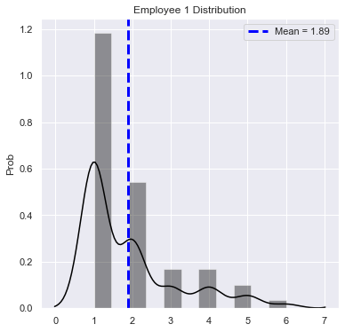


    SHAPIRO-WILK TEST at alpha = 0.05:
    The null hypothesis that sample was drawn from a normal distribution is REJECTED at p = 1.3427191580817066e-09
    
    D'AGOSTINO-PEARSON TEST at alpha = 0.05:
    The null hypothesis that sample was drawn from a normal distribution is REJECTED at p = 2.1810664560047295e-05
    
    ANDERSON-DARLING TEST at alpha = 0.05:
    The null hypothesis that sample was drawn from a normal distribution is REJECTED.
    Test Statistic: 6.942372674264902 > Critical Value 0.746
    


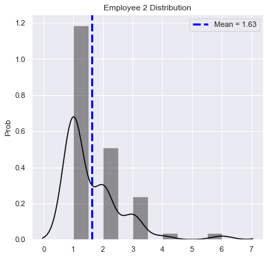


    SHAPIRO-WILK TEST at alpha = 0.05:
    The null hypothesis that sample was drawn from a normal distribution is REJECTED at p = 4.252184715447527e-10
    
    D'AGOSTINO-PEARSON TEST at alpha = 0.05:
    The null hypothesis that sample was drawn from a normal distribution is REJECTED at p = 1.0579941980948511e-09
    
    ANDERSON-DARLING TEST at alpha = 0.05:
    The null hypothesis that sample was drawn from a normal distribution is REJECTED.
    Test Statistic: 6.786922898467964 > Critical Value 0.742
    


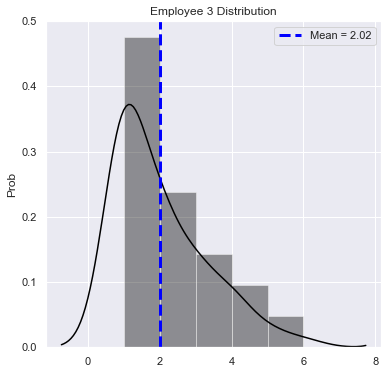


    SHAPIRO-WILK TEST at alpha = 0.05:
    The null hypothesis that sample was drawn from a normal distribution is REJECTED at p = 5.075458631154106e-08
    
    D'AGOSTINO-PEARSON TEST at alpha = 0.05:
    The null hypothesis that sample was drawn from a normal distribution is REJECTED at p = 0.0009242699497270381
    
    ANDERSON-DARLING TEST at alpha = 0.05:
    The null hypothesis that sample was drawn from a normal distribution is REJECTED.
    Test Statistic: 4.966299766639082 > Critical Value 0.744
    


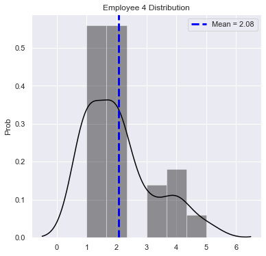


    SHAPIRO-WILK TEST at alpha = 0.05:
    The null hypothesis that sample was drawn from a normal distribution is REJECTED at p = 2.551854016985544e-08
    
    D'AGOSTINO-PEARSON TEST at alpha = 0.05:
    The null hypothesis that sample was drawn from a normal distribution is REJECTED at p = 0.004456274912399142
    
    ANDERSON-DARLING TEST at alpha = 0.05:
    The null hypothesis that sample was drawn from a normal distribution is REJECTED.
    Test Statistic: 5.336173137905192 > Critical Value 0.75
    


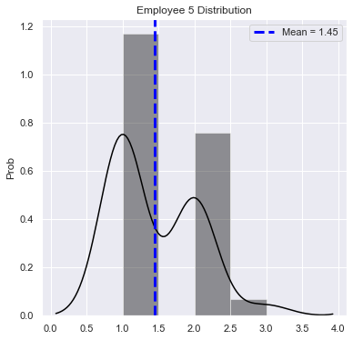


    SHAPIRO-WILK TEST at alpha = 0.05:
    The null hypothesis that sample was drawn from a normal distribution is REJECTED at p = 1.70596024418046e-06
    
    D'AGOSTINO-PEARSON TEST at alpha = 0.05:
    The null hypothesis that sample was drawn from a normal distribution is REJECTED at p = 0.16497084457863204
    
    ANDERSON-DARLING TEST at alpha = 0.05:
    The null hypothesis that sample was drawn from a normal distribution is REJECTED.
    Test Statistic: 4.2516345512440665 > Critical Value 0.71
    


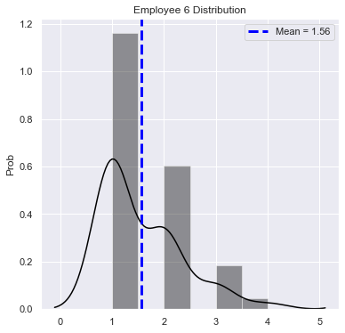


    SHAPIRO-WILK TEST at alpha = 0.05:
    The null hypothesis that sample was drawn from a normal distribution is REJECTED at p = 1.1312334891044884e-07
    
    D'AGOSTINO-PEARSON TEST at alpha = 0.05:
    The null hypothesis that sample was drawn from a normal distribution is REJECTED at p = 0.0017536125001405966
    
    ANDERSON-DARLING TEST at alpha = 0.05:
    The null hypothesis that sample was drawn from a normal distribution is REJECTED.
    Test Statistic: 5.049793488749515 > Critical Value 0.729
    


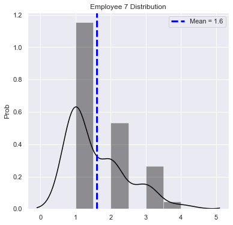


    SHAPIRO-WILK TEST at alpha = 0.05:
    The null hypothesis that sample was drawn from a normal distribution is REJECTED at p = 1.0546412454459642e-07
    
    D'AGOSTINO-PEARSON TEST at alpha = 0.05:
    The null hypothesis that sample was drawn from a normal distribution is REJECTED at p = 0.00941445460730022
    
    ANDERSON-DARLING TEST at alpha = 0.05:
    The null hypothesis that sample was drawn from a normal distribution is REJECTED.
    Test Statistic: 5.212481947195599 > Critical Value 0.731
    


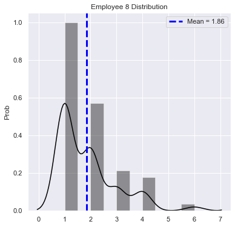


    SHAPIRO-WILK TEST at alpha = 0.05:
    The null hypothesis that sample was drawn from a normal distribution is REJECTED at p = 3.10819849858035e-08
    
    D'AGOSTINO-PEARSON TEST at alpha = 0.05:
    The null hypothesis that sample was drawn from a normal distribution is REJECTED at p = 2.0480181258595363e-05
    
    ANDERSON-DARLING TEST at alpha = 0.05:
    The null hypothesis that sample was drawn from a normal distribution is REJECTED.
    Test Statistic: 4.990979546633653 > Critical Value 0.74
    


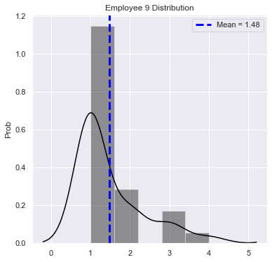


    SHAPIRO-WILK TEST at alpha = 0.05:
    The null hypothesis that sample was drawn from a normal distribution is REJECTED at p = 3.503367622670339e-07
    
    D'AGOSTINO-PEARSON TEST at alpha = 0.05:
    The null hypothesis that sample was drawn from a normal distribution is REJECTED at p = 0.0006212282294237795
    
    ANDERSON-DARLING TEST at alpha = 0.05:
    The null hypothesis that sample was drawn from a normal distribution is REJECTED.
    Test Statistic: 4.710159952305212 > Critical Value 0.71
    

Since none of these distributions are normally distributed, and the sample sizes are relatively small, I will be using the Kruskal-Wallis test two determine if a significant difference exists between two or more groups. These data meet the rule that each sample must have >= 5 observations.

## Test: Kruskal-Wallis Test


```python
st, p_val = stats.kruskal(
    rc_dict['Employee 1'], rc_dict['Employee 2'], rc_dict['Employee 3'], rc_dict['Employee 4'],
    rc_dict['Employee 5'], rc_dict['Employee 6'], rc_dict['Employee 7'], rc_dict['Employee 8'],
    rc_dict['Employee 9'])

alpha = 0.05

if p_val < 0.05:
    print('KRUSKAL-WALLIS TEST RESULT:\n')
    print(
        f'The null hypothesis IS rejected at alpha={alpha}, with a p-value of {round(p_val,3)}')
else:
    print('KRUSKAL-WALLIS TEST RESULT:\n')
    print(
        f'The null hypothesis is NOT rejected at alpha={alpha}, with a p-value of {round(p_val,3)}')
```

    KRUSKAL-WALLIS TEST RESULT:
    
    The null hypothesis IS rejected at alpha=0.05, with a p-value of 0.034
    

The Kruskal-Wallis Test detected a signficant difference between medians of at least two samples. 

## Post-Hoc Test: Dunn's Test
After a signficant Kruskal-Wallis Test result, I am using Dunn's Test for multiple comparisons of mean rank sums to determine which groups are significantly different.


```python
sp.posthoc_dunn(q3df, group_col='EmployeeId', val_col='CustomerId')
```


<div>
<style scoped>
    .dataframe tbody tr th:only-of-type {
        vertical-align: middle;
    }

    .dataframe tbody tr th {
        vertical-align: top;
    }

    .dataframe thead th {
        text-align: right;
    }
</style>
<table border="1" class="dataframe">
  <thead>
    <tr style="text-align: right;">
      <th></th>
      <th>1</th>
      <th>2</th>
      <th>3</th>
      <th>4</th>
      <th>5</th>
      <th>6</th>
      <th>7</th>
      <th>8</th>
      <th>9</th>
    </tr>
  </thead>
  <tbody>
    <tr>
      <td>1</td>
      <td>-1.000000</td>
      <td>0.113321</td>
      <td>0.228820</td>
      <td>0.561362</td>
      <td>0.128276</td>
      <td>0.907208</td>
      <td>0.841118</td>
      <td>0.722871</td>
      <td>0.022942</td>
    </tr>
    <tr>
      <td>2</td>
      <td>0.113321</td>
      <td>-1.000000</td>
      <td>0.006525</td>
      <td>0.027643</td>
      <td>0.761408</td>
      <td>0.142705</td>
      <td>0.233107</td>
      <td>0.234110</td>
      <td>0.000749</td>
    </tr>
    <tr>
      <td>3</td>
      <td>0.228820</td>
      <td>0.006525</td>
      <td>-1.000000</td>
      <td>0.491586</td>
      <td>0.017202</td>
      <td>0.372913</td>
      <td>0.217347</td>
      <td>0.131457</td>
      <td>0.155351</td>
    </tr>
    <tr>
      <td>4</td>
      <td>0.561362</td>
      <td>0.027643</td>
      <td>0.491586</td>
      <td>-1.000000</td>
      <td>0.049241</td>
      <td>0.720106</td>
      <td>0.483704</td>
      <td>0.354229</td>
      <td>0.053264</td>
    </tr>
    <tr>
      <td>5</td>
      <td>0.128276</td>
      <td>0.761408</td>
      <td>0.017202</td>
      <td>0.049241</td>
      <td>-1.000000</td>
      <td>0.141285</td>
      <td>0.212489</td>
      <td>0.219309</td>
      <td>0.001869</td>
    </tr>
    <tr>
      <td>6</td>
      <td>0.907208</td>
      <td>0.142705</td>
      <td>0.372913</td>
      <td>0.720106</td>
      <td>0.141285</td>
      <td>-1.000000</td>
      <td>0.779858</td>
      <td>0.678482</td>
      <td>0.048664</td>
    </tr>
    <tr>
      <td>7</td>
      <td>0.841118</td>
      <td>0.233107</td>
      <td>0.217347</td>
      <td>0.483704</td>
      <td>0.212489</td>
      <td>0.779858</td>
      <td>-1.000000</td>
      <td>0.909153</td>
      <td>0.024767</td>
    </tr>
    <tr>
      <td>8</td>
      <td>0.722871</td>
      <td>0.234110</td>
      <td>0.131457</td>
      <td>0.354229</td>
      <td>0.219309</td>
      <td>0.678482</td>
      <td>0.909153</td>
      <td>-1.000000</td>
      <td>0.013029</td>
    </tr>
    <tr>
      <td>9</td>
      <td>0.022942</td>
      <td>0.000749</td>
      <td>0.155351</td>
      <td>0.053264</td>
      <td>0.001869</td>
      <td>0.048664</td>
      <td>0.024767</td>
      <td>0.013029</td>
      <td>-1.000000</td>
    </tr>
  </tbody>
</table>
</div>


```python
# Combination violinplot and swarmplot for Employee 9 vs all other employees

plt.figure(figsize=(16,12))

# Loop to plot each subplot
n=0
for k,v in rc_dict.items():
    n += 1
    dfx = pd.DataFrame([])
    df9 = pd.DataFrame([])
    dfx['Counts'] = rc_dict[k]
    dfx['Emp'] = k
    df9['Counts'] = rc_dict['Employee 9']
    df9['Emp'] = 'Employee 9'
    dfx9 = pd.concat([dfx, df9])
    plt.subplot(420 + n)
    sns.swarmplot(data=dfx9, x='Emp', y='Counts', color='black')
    sns.violinplot(data=dfx9, x='Emp', y='Counts', scale='width', inner='stick')
    plt.ylabel('Orders per Customer')
    plt.xlabel('')
    
    # Don't want to compare employee 9 to employee 9
    if n >= 8:
        break

plt.suptitle("Number of Orders by Unique Customers ('Repeat Orders') - All Employees vs. Employee 9", y=0.92)
plt.show();
```


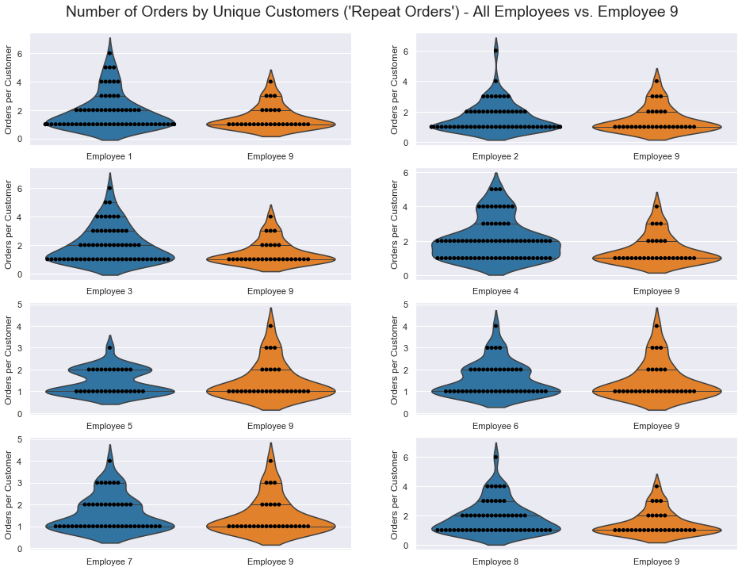


## Interpretation: Question 3

Following the signficant result of the Kruskal-Wallis Test, the post-hoc Dunn's test revealed that the group "Employee 9" is significantly different in the number of orders per unique customer than nearly every other employee (with the exception of Employee 3). The combined Swarm & Violin plots above reveal that Employee 9 generally has a much lower proportion of 'repeat customers' (customers who have made more than 1 order with an employee) than other employees. This is a target for future improvement, through customer service training, for Employee 9 to increase their 'repeat customer' order rate.

# Question # 4: Time of Year & Quantity Product in Order
Does the time of year have a statistically significant effect on quantity of a product per order?

## Obtain
Need to obtain the Order and OrderDetail tables, and join them


```python
# Obtain OrderDetail table, create a pandas dataframe

cur.execute("""SELECT * FROM OrderDetail""")
df_od = pd.DataFrame(cur.fetchall())
df_od.columns = [x[0] for x in cur.description]
df_od.head()
```


<div>
<style scoped>
    .dataframe tbody tr th:only-of-type {
        vertical-align: middle;
    }

    .dataframe tbody tr th {
        vertical-align: top;
    }

    .dataframe thead th {
        text-align: right;
    }
</style>
<table border="1" class="dataframe">
  <thead>
    <tr style="text-align: right;">
      <th></th>
      <th>Id</th>
      <th>OrderId</th>
      <th>ProductId</th>
      <th>UnitPrice</th>
      <th>Quantity</th>
      <th>Discount</th>
    </tr>
  </thead>
  <tbody>
    <tr>
      <td>0</td>
      <td>10248/11</td>
      <td>10248</td>
      <td>11</td>
      <td>14.0</td>
      <td>12</td>
      <td>0.0</td>
    </tr>
    <tr>
      <td>1</td>
      <td>10248/42</td>
      <td>10248</td>
      <td>42</td>
      <td>9.8</td>
      <td>10</td>
      <td>0.0</td>
    </tr>
    <tr>
      <td>2</td>
      <td>10248/72</td>
      <td>10248</td>
      <td>72</td>
      <td>34.8</td>
      <td>5</td>
      <td>0.0</td>
    </tr>
    <tr>
      <td>3</td>
      <td>10249/14</td>
      <td>10249</td>
      <td>14</td>
      <td>18.6</td>
      <td>9</td>
      <td>0.0</td>
    </tr>
    <tr>
      <td>4</td>
      <td>10249/51</td>
      <td>10249</td>
      <td>51</td>
      <td>42.4</td>
      <td>40</td>
      <td>0.0</td>
    </tr>
  </tbody>
</table>
</div>


```python
# Obtain Order table, create a pandas dataframe
cur.execute("""SELECT * FROM 'Order'""")
df_o = pd.DataFrame(cur.fetchall())
df_o.columns = [x[0] for x in cur.description]
df_o.head()
```


<div>
<style scoped>
    .dataframe tbody tr th:only-of-type {
        vertical-align: middle;
    }

    .dataframe tbody tr th {
        vertical-align: top;
    }

    .dataframe thead th {
        text-align: right;
    }
</style>
<table border="1" class="dataframe">
  <thead>
    <tr style="text-align: right;">
      <th></th>
      <th>Id</th>
      <th>CustomerId</th>
      <th>EmployeeId</th>
      <th>OrderDate</th>
      <th>RequiredDate</th>
      <th>ShippedDate</th>
      <th>ShipVia</th>
      <th>Freight</th>
      <th>ShipName</th>
      <th>ShipAddress</th>
      <th>ShipCity</th>
      <th>ShipRegion</th>
      <th>ShipPostalCode</th>
      <th>ShipCountry</th>
    </tr>
  </thead>
  <tbody>
    <tr>
      <td>0</td>
      <td>10248</td>
      <td>VINET</td>
      <td>5</td>
      <td>2012-07-04</td>
      <td>2012-08-01</td>
      <td>2012-07-16</td>
      <td>3</td>
      <td>32.38</td>
      <td>Vins et alcools Chevalier</td>
      <td>59 rue de l'Abbaye</td>
      <td>Reims</td>
      <td>Western Europe</td>
      <td>51100</td>
      <td>France</td>
    </tr>
    <tr>
      <td>1</td>
      <td>10249</td>
      <td>TOMSP</td>
      <td>6</td>
      <td>2012-07-05</td>
      <td>2012-08-16</td>
      <td>2012-07-10</td>
      <td>1</td>
      <td>11.61</td>
      <td>Toms Spezialitäten</td>
      <td>Luisenstr. 48</td>
      <td>Münster</td>
      <td>Western Europe</td>
      <td>44087</td>
      <td>Germany</td>
    </tr>
    <tr>
      <td>2</td>
      <td>10250</td>
      <td>HANAR</td>
      <td>4</td>
      <td>2012-07-08</td>
      <td>2012-08-05</td>
      <td>2012-07-12</td>
      <td>2</td>
      <td>65.83</td>
      <td>Hanari Carnes</td>
      <td>Rua do Paço, 67</td>
      <td>Rio de Janeiro</td>
      <td>South America</td>
      <td>05454-876</td>
      <td>Brazil</td>
    </tr>
    <tr>
      <td>3</td>
      <td>10251</td>
      <td>VICTE</td>
      <td>3</td>
      <td>2012-07-08</td>
      <td>2012-08-05</td>
      <td>2012-07-15</td>
      <td>1</td>
      <td>41.34</td>
      <td>Victuailles en stock</td>
      <td>2, rue du Commerce</td>
      <td>Lyon</td>
      <td>Western Europe</td>
      <td>69004</td>
      <td>France</td>
    </tr>
    <tr>
      <td>4</td>
      <td>10252</td>
      <td>SUPRD</td>
      <td>4</td>
      <td>2012-07-09</td>
      <td>2012-08-06</td>
      <td>2012-07-11</td>
      <td>2</td>
      <td>51.30</td>
      <td>Suprêmes délices</td>
      <td>Boulevard Tirou, 255</td>
      <td>Charleroi</td>
      <td>Western Europe</td>
      <td>B-6000</td>
      <td>Belgium</td>
    </tr>
  </tbody>
</table>
</div>


## Scrub / Explore


```python
# Now join Order and OrderDetail, keeping only OrderId, ProductId, Quantity, OrderDate

cur.execute("""SELECT OrderId, ProductId, Quantity, OrderDate
            FROM 'Order' as o
            JOIN OrderDetail as od
            ON o.Id = od.OrderId
            ;""")
ordersfull_df = pd.DataFrame(cur.fetchall())
ordersfull_df.columns = [x[0] for x in cur.description]
ordersfull_df
```


<div>
<style scoped>
    .dataframe tbody tr th:only-of-type {
        vertical-align: middle;
    }

    .dataframe tbody tr th {
        vertical-align: top;
    }

    .dataframe thead th {
        text-align: right;
    }
</style>
<table border="1" class="dataframe">
  <thead>
    <tr style="text-align: right;">
      <th></th>
      <th>OrderId</th>
      <th>ProductId</th>
      <th>Quantity</th>
      <th>OrderDate</th>
    </tr>
  </thead>
  <tbody>
    <tr>
      <td>0</td>
      <td>10248</td>
      <td>11</td>
      <td>12</td>
      <td>2012-07-04</td>
    </tr>
    <tr>
      <td>1</td>
      <td>10248</td>
      <td>42</td>
      <td>10</td>
      <td>2012-07-04</td>
    </tr>
    <tr>
      <td>2</td>
      <td>10248</td>
      <td>72</td>
      <td>5</td>
      <td>2012-07-04</td>
    </tr>
    <tr>
      <td>3</td>
      <td>10249</td>
      <td>14</td>
      <td>9</td>
      <td>2012-07-05</td>
    </tr>
    <tr>
      <td>4</td>
      <td>10249</td>
      <td>51</td>
      <td>40</td>
      <td>2012-07-05</td>
    </tr>
    <tr>
      <td>...</td>
      <td>...</td>
      <td>...</td>
      <td>...</td>
      <td>...</td>
    </tr>
    <tr>
      <td>2150</td>
      <td>11077</td>
      <td>64</td>
      <td>2</td>
      <td>2014-05-06</td>
    </tr>
    <tr>
      <td>2151</td>
      <td>11077</td>
      <td>66</td>
      <td>1</td>
      <td>2014-05-06</td>
    </tr>
    <tr>
      <td>2152</td>
      <td>11077</td>
      <td>73</td>
      <td>2</td>
      <td>2014-05-06</td>
    </tr>
    <tr>
      <td>2153</td>
      <td>11077</td>
      <td>75</td>
      <td>4</td>
      <td>2014-05-06</td>
    </tr>
    <tr>
      <td>2154</td>
      <td>11077</td>
      <td>77</td>
      <td>2</td>
      <td>2014-05-06</td>
    </tr>
  </tbody>
</table>
<p>2155 rows × 4 columns</p>
</div>


```python
# What are the min and max order dates to deal with?

print(f'Max (latest) date is {ordersfull_df.OrderDate.max()}')
print(f'Min (earliest) date is {ordersfull_df.OrderDate.min()}')
```

    Max (latest) date is 2014-05-06
    Min (earliest) date is 2012-07-04
    


```python
# Create new categorical variable: Quarter (of year in which order was placed)

ordersfull_df['Q'] = None

for i, x in enumerate(ordersfull_df['OrderDate']):
    if (x >= '2012-07-01') & (x <= '2012-09-30'):
        ordersfull_df['Q'][i] = 3
    elif (x >= '2012-10-01') & (x <= '2012-12-31'):
        ordersfull_df['Q'][i] = 4
    elif (x >= '2013-01-01') & (x <= '2013-03-31'):
        ordersfull_df['Q'][i] = 1
    elif (x >= '2013-04-01') & (x <= '2013-06-30'):
        ordersfull_df['Q'][i] = 2
    elif (x >= '2013-07-01') & (x <= '2013-09-30'):
        ordersfull_df['Q'][i] = 3
    elif (x >= '2013-10-01') & (x <= '2013-12-31'):
        ordersfull_df['Q'][i] = 4
    elif (x >= '2014-01-01') & (x <= '2014-03-31'):
        ordersfull_df['Q'][i] = 1
    elif (x >= '2014-04-01') & (x <= '2014-06-30'):
        ordersfull_df['Q'][i] = 2

ordersfull_df.head()
```


<div>
<style scoped>
    .dataframe tbody tr th:only-of-type {
        vertical-align: middle;
    }

    .dataframe tbody tr th {
        vertical-align: top;
    }

    .dataframe thead th {
        text-align: right;
    }
</style>
<table border="1" class="dataframe">
  <thead>
    <tr style="text-align: right;">
      <th></th>
      <th>OrderId</th>
      <th>ProductId</th>
      <th>Quantity</th>
      <th>OrderDate</th>
      <th>Q</th>
    </tr>
  </thead>
  <tbody>
    <tr>
      <td>0</td>
      <td>10248</td>
      <td>11</td>
      <td>12</td>
      <td>2012-07-04</td>
      <td>3</td>
    </tr>
    <tr>
      <td>1</td>
      <td>10248</td>
      <td>42</td>
      <td>10</td>
      <td>2012-07-04</td>
      <td>3</td>
    </tr>
    <tr>
      <td>2</td>
      <td>10248</td>
      <td>72</td>
      <td>5</td>
      <td>2012-07-04</td>
      <td>3</td>
    </tr>
    <tr>
      <td>3</td>
      <td>10249</td>
      <td>14</td>
      <td>9</td>
      <td>2012-07-05</td>
      <td>3</td>
    </tr>
    <tr>
      <td>4</td>
      <td>10249</td>
      <td>51</td>
      <td>40</td>
      <td>2012-07-05</td>
      <td>3</td>
    </tr>
  </tbody>
</table>
</div>


```python
# Create variables for quantities in each order for each quarter

Q1 = ordersfull_df[ordersfull_df['Q'] == 1].Quantity
Q2 = ordersfull_df[ordersfull_df['Q'] == 2].Quantity
Q3 = ordersfull_df[ordersfull_df['Q'] == 3].Quantity
Q4 = ordersfull_df[ordersfull_df['Q'] == 4].Quantity
```


```python
# Save these to a dictionary with names for easy access

quarters = [Q1, Q2, Q3, Q4]
q_names = ['1st Quarter', '2nd Quarter', '3rd Quarter', '4th Quarter']

q_dict = dict(zip(q_names, quarters))
q_dict
```


    {'1st Quarter': 405     21
     406     35
     407     30
     408     18
     409     70
             ..
     1911    60
     1912    40
     1913    40
     1914    15
     1915     4
     Name: Quantity, Length: 693, dtype: int64, '2nd Quarter': 646     60
     647     20
     648     15
     649     10
     650     10
             ..
     2150     2
     2151     1
     2152     2
     2153     4
     2154     2
     Name: Quantity, Length: 492, dtype: int64, '3rd Quarter': 0       12
     1       10
     2        5
     3        9
     4       40
             ..
     1150    30
     1151    15
     1152    50
     1153    10
     1154     6
     Name: Quantity, Length: 441, dtype: int64, '4th Quarter': 185     20
     186      6
     187      8
     188     14
     189     30
             ..
     1459    10
     1460    20
     1461     2
     1462    15
     1463     1
     Name: Quantity, Length: 529, dtype: int64}


```python
# Check out quantity of products ordered distributions for each quarter

for k, v in q_dict.items():
    dist = DistChecker(v, k)
    dist.plot_dist()
    dist.norm_tests()
```


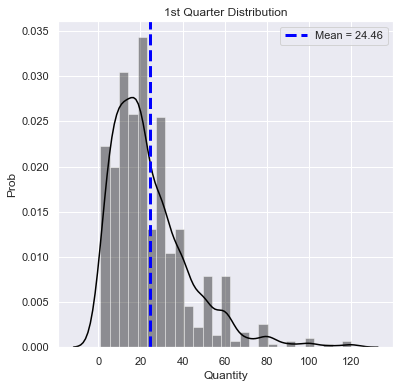


    SHAPIRO-WILK TEST at alpha = 0.05:
    The null hypothesis that sample was drawn from a normal distribution is REJECTED at p = 1.547062258044066e-23
    
    D'AGOSTINO-PEARSON TEST at alpha = 0.05:
    The null hypothesis that sample was drawn from a normal distribution is REJECTED at p = 9.373573227575504e-50
    
    ANDERSON-DARLING TEST at alpha = 0.05:
    The null hypothesis that sample was drawn from a normal distribution is REJECTED.
    Test Statistic: 21.170675314487426 > Critical Value 0.783
    


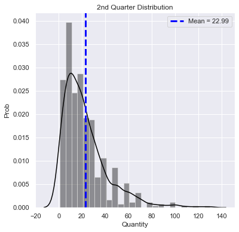


    SHAPIRO-WILK TEST at alpha = 0.05:
    The null hypothesis that sample was drawn from a normal distribution is REJECTED at p = 5.204523075058833e-22
    
    D'AGOSTINO-PEARSON TEST at alpha = 0.05:
    The null hypothesis that sample was drawn from a normal distribution is REJECTED at p = 2.555730059276382e-43
    
    ANDERSON-DARLING TEST at alpha = 0.05:
    The null hypothesis that sample was drawn from a normal distribution is REJECTED.
    Test Statistic: 19.641907177172413 > Critical Value 0.781
    


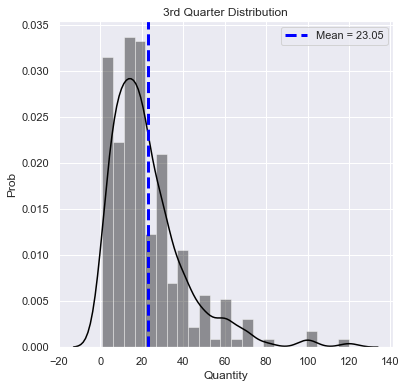


    SHAPIRO-WILK TEST at alpha = 0.05:
    The null hypothesis that sample was drawn from a normal distribution is REJECTED at p = 7.77799222453319e-21
    
    D'AGOSTINO-PEARSON TEST at alpha = 0.05:
    The null hypothesis that sample was drawn from a normal distribution is REJECTED at p = 4.3500761680111635e-41
    
    ANDERSON-DARLING TEST at alpha = 0.05:
    The null hypothesis that sample was drawn from a normal distribution is REJECTED.
    Test Statistic: 16.78838825289381 > Critical Value 0.78
    


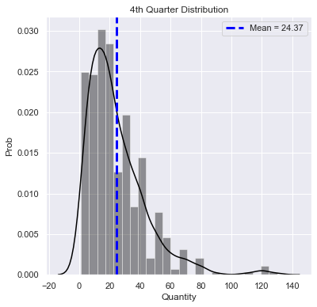


    SHAPIRO-WILK TEST at alpha = 0.05:
    The null hypothesis that sample was drawn from a normal distribution is REJECTED at p = 2.853270514248011e-22
    
    D'AGOSTINO-PEARSON TEST at alpha = 0.05:
    The null hypothesis that sample was drawn from a normal distribution is REJECTED at p = 1.4844186058916446e-48
    
    ANDERSON-DARLING TEST at alpha = 0.05:
    The null hypothesis that sample was drawn from a normal distribution is REJECTED.
    Test Statistic: 17.653639748422393 > Critical Value 0.781
    

It appears that all groups have high outliers that may be influencing the means / normality of distributions. I will perform outlier removal before proceeding with significance testing, using IQR scores.


```python
out_q = []

for quarter in quarters:
    q1, q3 = np.percentile(a=quarter, q=[25, 75])
    iqr = q3 - q1
    lower_bound = q1 - (1.5*iqr)
    upper_bound = q3 + (1.5*iqr)
    fr_out = quarter.to_list()
    for obs in fr_out:
        if obs < lower_bound or obs > upper_bound:
            fr_out.remove(obs)
        else:
            continue
    out_q.append(fr_out)

#     outliers.append(list(
#         df_scrub[(df_scrub[col] < lower_bound) | (df_scrub[col] > upper_bound)].index))


out_q
```


    [[21,
      35,
      30,
      18,
      20,
      60,
      60,
      21,
      30,
      40,
      30,
      50,
      10,
      30,
      42,
      5,
      2,
      30,
      15,
      15,
      10,
      6,
      35,
      12,
      12,
      49,
      16,
      25,
      40,
      9,
      20,
      24,
      40,
      14,
      18,
      50,
      2,
      20,
      20,
      10,
      20,
      50,
      2,
      36,
      35,
      60,
      55,
      16,
      15,
      60,
      20,
      20,
      2,
      8,
      20,
      4,
      30,
      15,
      10,
      2,
      14,
      20,
      60,
      49,
      30,
      10,
      20,
      5,
      7,
      35,
      20,
      40,
      35,
      45,
      50,
      30,
      50,
      50,
      30,
      10,
      40,
      28,
      6,
      18,
      10,
      12,
      10,
      5,
      40,
      30,
      24,
      15,
      15,
      20,
      15,
      15,
      16,
      6,
      30,
      45,
      49,
      24,
      50,
      30,
      60,
      6,
      12,
      10,
      15,
      8,
      30,
      6,
      15,
      12,
      20,
      3,
      15,
      40,
      35,
      2,
      6,
      20,
      14,
      20,
      35,
      20,
      6,
      35,
      28,
      55,
      15,
      15,
      25,
      20,
      20,
      10,
      20,
      50,
      25,
      30,
      40,
      21,
      36,
      30,
      30,
      20,
      15,
      50,
      16,
      20,
      40,
      21,
      4,
      40,
      28,
      60,
      1,
      21,
      21,
      50,
      16,
      3,
      30,
      20,
      25,
      18,
      20,
      30,
      25,
      10,
      5,
      28,
      12,
      8,
      15,
      40,
      35,
      2,
      30,
      15,
      8,
      30,
      20,
      18,
      12,
      12,
      12,
      18,
      21,
      10,
      35,
      60,
      42,
      2,
      12,
      15,
      21,
      20,
      20,
      30,
      28,
      60,
      30,
      30,
      12,
      24,
      40,
      10,
      35,
      30,
      14,
      10,
      3,
      20,
      20,
      30,
      60,
      5,
      25,
      16,
      5,
      30,
      24,
      30,
      20,
      15,
      18,
      60,
      30,
      36,
      15,
      7,
      20,
      50,
      20,
      7,
      5,
      5,
      15,
      18,
      30,
      16,
      40,
      20,
      12,
      35,
      20,
      20,
      8,
      30,
      16,
      30,
      20,
      40,
      30,
      60,
      25,
      20,
      20,
      7,
      20,
      30,
      20,
      6,
      3,
      6,
      20,
      15,
      40,
      15,
      12,
      9,
      12,
      20,
      35,
      15,
      15,
      21,
      5,
      2,
      10,
      20,
      10,
      21,
      6,
      28,
      30,
      24,
      2,
      8,
      8,
      9,
      3,
      10,
      16,
      3,
      20,
      9,
      9,
      8,
      20,
      15,
      2,
      52,
      6,
      24,
      60,
      30,
      6,
      25,
      40,
      21,
      4,
      25,
      50,
      30,
      15,
      6,
      10,
      16,
      30,
      50,
      15,
      15,
      5,
      20,
      12,
      4,
      35,
      25,
      42,
      60,
      48,
      21,
      30,
      20,
      12,
      60,
      36,
      45,
      55,
      30,
      3,
      49,
      18,
      20,
      4,
      30,
      5,
      10,
      10,
      42,
      15,
      6,
      50,
      10,
      65,
      50,
      14,
      24,
      15,
      20,
      20,
      30,
      35,
      10,
      5,
      10,
      4,
      40,
      35,
      30,
      3,
      20,
      42,
      20,
      40,
      35,
      3,
      25,
      8,
      20,
      12,
      4,
      15,
      60,
      21,
      6,
      40,
      3,
      20,
      30,
      42,
      40,
      10,
      50,
      20,
      3,
      2,
      50,
      12,
      16,
      10,
      20,
      15,
      21,
      20,
      3,
      10,
      25,
      21,
      15,
      21,
      20,
      30,
      25,
      20,
      12,
      10,
      10,
      30,
      30,
      50,
      10,
      25,
      20,
      32,
      8,
      40,
      21,
      12,
      20,
      12,
      30,
      25,
      35,
      40,
      5,
      20,
      18,
      40,
      40,
      15,
      10,
      14,
      15,
      40,
      30,
      10,
      24,
      35,
      20,
      28,
      50,
      110,
      45,
      100,
      15,
      16,
      36,
      5,
      8,
      3,
      30,
      30,
      30,
      6,
      40,
      21,
      20,
      15,
      35,
      20,
      15,
      14,
      20,
      14,
      12,
      15,
      5,
      12,
      10,
      5,
      10,
      12,
      15,
      40,
      60,
      30,
      40,
      15,
      25,
      10,
      30,
      10,
      6,
      6,
      20,
      1,
      10,
      60,
      25,
      24,
      24,
      20,
      24,
      10,
      40,
      15,
      35,
      10,
      10,
      24,
      20,
      30,
      6,
      25,
      12,
      2,
      10,
      7,
      10,
      5,
      5,
      20,
      5,
      5,
      60,
      49,
      15,
      36,
      25,
      25,
      30,
      42,
      30,
      30,
      14,
      16,
      20,
      2,
      30,
      20,
      21,
      4,
      8,
      30,
      8,
      20,
      20,
      24,
      49,
      35,
      10,
      40,
      8,
      20,
      44,
      30,
      50,
      28,
      15,
      21,
      15,
      5,
      18,
      18,
      20,
      10,
      25,
      25,
      40,
      4,
      9,
      40,
      4,
      12,
      30,
      6,
      60,
      5,
      15,
      6,
      50,
      16,
      2,
      50,
      50,
      28,
      25,
      30,
      24,
      12,
      12,
      14,
      8,
      30,
      40,
      8,
      20,
      6,
      5,
      20,
      10,
      24,
      6,
      60,
      45,
      20,
      9,
      44,
      2,
      6,
      5,
      10,
      16,
      8,
      12,
      12,
      12,
      40,
      30,
      30,
      4,
      9,
      40,
      14,
      6,
      7,
      5,
      6,
      10,
      10,
      16,
      10,
      20,
      30,
      30,
      10,
      20,
      20,
      40,
      10,
      6,
      18,
      20,
      30,
      24,
      35,
      40,
      60,
      20,
      9,
      15,
      55,
      20,
      40,
      36,
      8,
      35,
      30,
      15,
      10,
      15,
      60,
      6,
      20,
      60,
      40,
      40,
      15,
      4],
     [60,
      20,
      15,
      10,
      10,
      30,
      10,
      20,
      5,
      20,
      14,
      25,
      25,
      14,
      5,
      30,
      20,
      25,
      12,
      8,
      20,
      21,
      6,
      30,
      20,
      12,
      12,
      10,
      25,
      3,
      18,
      14,
      15,
      15,
      10,
      10,
      3,
      36,
      36,
      50,
      50,
      10,
      10,
      9,
      6,
      12,
      40,
      50,
      15,
      39,
      35,
      39,
      50,
      16,
      50,
      16,
      25,
      20,
      6,
      4,
      6,
      5,
      15,
      9,
      16,
      40,
      10,
      8,
      5,
      3,
      10,
      6,
      40,
      24,
      20,
      25,
      25,
      15,
      18,
      6,
      2,
      10,
      60,
      15,
      30,
      15,
      8,
      10,
      30,
      50,
      30,
      3,
      8,
      9,
      14,
      20,
      10,
      40,
      25,
      20,
      50,
      2,
      15,
      24,
      50,
      24,
      24,
      10,
      10,
      10,
      50,
      10,
      5,
      15,
      15,
      20,
      30,
      35,
      30,
      6,
      20,
      21,
      9,
      7,
      1,
      8,
      15,
      15,
      6,
      60,
      40,
      30,
      35,
      35,
      4,
      36,
      9,
      15,
      24,
      30,
      7,
      7,
      10,
      10,
      30,
      40,
      24,
      60,
      10,
      14,
      55,
      48,
      8,
      10,
      6,
      10,
      40,
      20,
      40,
      18,
      30,
      15,
      14,
      24,
      30,
      6,
      30,
      20,
      20,
      10,
      30,
      35,
      18,
      20,
      40,
      24,
      30,
      20,
      25,
      20,
      30,
      18,
      3,
      12,
      18,
      20,
      15,
      10,
      50,
      20,
      10,
      25,
      16,
      6,
      25,
      25,
      18,
      35,
      18,
      10,
      60,
      3,
      40,
      5,
      35,
      30,
      15,
      60,
      11,
      28,
      12,
      10,
      50,
      15,
      18,
      40,
      25,
      14,
      2,
      10,
      6,
      12,
      6,
      30,
      10,
      10,
      20,
      21,
      10,
      20,
      18,
      20,
      6,
      10,
      21,
      15,
      9,
      30,
      50,
      4,
      14,
      10,
      24,
      10,
      50,
      60,
      66,
      50,
      20,
      2,
      50,
      35,
      18,
      20,
      4,
      40,
      50,
      20,
      20,
      12,
      7,
      20,
      30,
      20,
      15,
      21,
      25,
      30,
      30,
      60,
      25,
      25,
      6,
      56,
      15,
      24,
      40,
      4,
      10,
      10,
      6,
      6,
      2,
      10,
      8,
      2,
      30,
      10,
      14,
      90,
      21,
      12,
      18,
      9,
      20,
      10,
      40,
      20,
      50,
      36,
      60,
      10,
      4,
      20,
      2,
      28,
      15,
      18,
      15,
      16,
      25,
      30,
      20,
      10,
      5,
      3,
      2,
      24,
      11,
      15,
      44,
      35,
      35,
      30,
      4,
      30,
      12,
      30,
      21,
      50,
      10,
      20,
      8,
      10,
      30,
      21,
      35,
      24,
      20,
      12,
      60,
      45,
      21,
      20,
      16,
      35,
      25,
      30,
      70,
      36,
      15,
      12,
      6,
      10,
      60,
      30,
      10,
      7,
      30,
      4,
      5,
      2,
      30,
      20,
      24,
      60,
      28,
      20,
      30,
      30,
      15,
      4,
      10,
      12,
      15,
      24,
      20,
      15,
      18,
      25,
      30,
      42,
      10,
      4,
      50,
      10,
      30,
      10,
      35,
      20,
      25,
      10,
      20,
      15,
      15,
      20,
      20,
      40,
      35,
      50,
      3,
      3,
      21,
      4,
      30,
      12,
      35,
      4,
      10,
      15,
      10,
      12,
      30,
      40,
      30,
      12,
      25,
      4,
      55,
      4,
      20,
      3,
      42,
      35,
      9,
      8,
      36,
      28,
      20,
      40,
      20,
      30,
      20,
      15,
      10,
      8,
      40,
      22,
      10,
      20,
      14,
      10,
      30,
      2,
      20,
      20,
      10,
      24,
      4,
      1,
      1,
      1,
      2,
      1,
      2,
      4,
      1,
      2,
      1,
      2,
      1,
      2,
      3,
      3,
      2,
      2,
      2,
      2,
      1,
      2,
      4,
      2],
     [12,
      10,
      5,
      9,
      40,
      10,
      35,
      15,
      6,
      15,
      20,
      40,
      25,
      40,
      20,
      42,
      40,
      15,
      21,
      21,
      20,
      35,
      25,
      30,
      15,
      12,
      25,
      6,
      15,
      50,
      6,
      10,
      1,
      16,
      50,
      15,
      21,
      20,
      20,
      12,
      15,
      2,
      60,
      28,
      60,
      36,
      35,
      25,
      30,
      20,
      12,
      50,
      15,
      10,
      4,
      60,
      20,
      30,
      25,
      24,
      6,
      40,
      24,
      24,
      15,
      20,
      60,
      33,
      20,
      7,
      12,
      6,
      15,
      10,
      20,
      12,
      16,
      15,
      8,
      25,
      15,
      12,
      20,
      30,
      1,
      6,
      4,
      6,
      2,
      20,
      18,
      35,
      3,
      15,
      21,
      20,
      5,
      45,
      40,
      36,
      40,
      40,
      20,
      15,
      10,
      3,
      30,
      9,
      20,
      15,
      15,
      10,
      20,
      24,
      2,
      20,
      12,
      10,
      5,
      6,
      18,
      15,
      15,
      21,
      6,
      4,
      12,
      30,
      15,
      60,
      20,
      40,
      40,
      30,
      15,
      15,
      20,
      30,
      20,
      10,
      20,
      40,
      28,
      12,
      40,
      30,
      15,
      30,
      10,
      2,
      25,
      25,
      30,
      10,
      10,
      5,
      10,
      3,
      1,
      5,
      20,
      30,
      2,
      20,
      3,
      10,
      5,
      6,
      7,
      4,
      24,
      20,
      10,
      12,
      40,
      30,
      25,
      14,
      30,
      10,
      20,
      15,
      4,
      6,
      20,
      20,
      40,
      4,
      20,
      60,
      14,
      10,
      50,
      25,
      5,
      21,
      20,
      4,
      24,
      30,
      30,
      65,
      5,
      24,
      30,
      35,
      20,
      12,
      50,
      9,
      10,
      4,
      30,
      60,
      35,
      5,
      48,
      25,
      6,
      10,
      30,
      20,
      15,
      20,
      20,
      10,
      45,
      14,
      42,
      12,
      28,
      3,
      10,
      6,
      21,
      6,
      10,
      15,
      55,
      18,
      40,
      8,
      40,
      14,
      8,
      5,
      5,
      15,
      14,
      15,
      15,
      30,
      20,
      15,
      42,
      40,
      5,
      5,
      5,
      10,
      20,
      15,
      20,
      18,
      21,
      15,
      25,
      3,
      30,
      10,
      6,
      10,
      3,
      5,
      10,
      12,
      20,
      20,
      15,
      35,
      25,
      20,
      9,
      12,
      35,
      8,
      30,
      20,
      36,
      13,
      35,
      35,
      50,
      15,
      2,
      10,
      15,
      40,
      25,
      6,
      10,
      25,
      60,
      20,
      21,
      60,
      8,
      20,
      15,
      50,
      60,
      30,
      20,
      15,
      21,
      2,
      4,
      20,
      21,
      20,
      15,
      15,
      18,
      30,
      35,
      30,
      20,
      15,
      15,
      20,
      15,
      30,
      25,
      30,
      12,
      20,
      2,
      20,
      30,
      20,
      12,
      20,
      6,
      20,
      3,
      28,
      6,
      50,
      24,
      45,
      10,
      45,
      30,
      60,
      55,
      20,
      24,
      40,
      21,
      3,
      49,
      10,
      30,
      30,
      20,
      24,
      12,
      15,
      20,
      1,
      10,
      36,
      10,
      45,
      14,
      8,
      4,
      15,
      30,
      32,
      60,
      25,
      50,
      25,
      10,
      10,
      12,
      15,
      12,
      3,
      6,
      6,
      5,
      30,
      10,
      30,
      2,
      7,
      21,
      30,
      8,
      30,
      30,
      12,
      50,
      20,
      40,
      30,
      12,
      28,
      30,
      4,
      30,
      9,
      20,
      40,
      30,
      20,
      4,
      15,
      30,
      15,
      50,
      10,
      6],
     [20,
      6,
      8,
      14,
      30,
      30,
      10,
      20,
      5,
      4,
      4,
      21,
      30,
      40,
      6,
      12,
      9,
      4,
      40,
      24,
      16,
      50,
      25,
      50,
      35,
      30,
      9,
      40,
      10,
      10,
      8,
      20,
      12,
      50,
      25,
      15,
      40,
      10,
      16,
      10,
      10,
      40,
      8,
      10,
      7,
      25,
      6,
      48,
      18,
      40,
      24,
      20,
      28,
      25,
      20,
      15,
      10,
      28,
      20,
      12,
      40,
      8,
      9,
      24,
      56,
      40,
      40,
      50,
      4,
      15,
      35,
      9,
      36,
      20,
      10,
      50,
      4,
      6,
      15,
      25,
      24,
      15,
      18,
      20,
      13,
      10,
      10,
      20,
      12,
      50,
      12,
      4,
      25,
      25,
      30,
      12,
      20,
      30,
      16,
      8,
      10,
      10,
      20,
      56,
      30,
      35,
      10,
      35,
      28,
      54,
      55,
      50,
      20,
      24,
      20,
      12,
      12,
      30,
      5,
      24,
      5,
      5,
      36,
      18,
      15,
      7,
      5,
      13,
      25,
      35,
      20,
      18,
      15,
      30,
      20,
      6,
      12,
      40,
      42,
      80,
      50,
      30,
      15,
      15,
      10,
      42,
      20,
      20,
      6,
      8,
      16,
      20,
      18,
      20,
      6,
      30,
      14,
      32,
      9,
      14,
      60,
      50,
      20,
      15,
      20,
      28,
      15,
      10,
      20,
      8,
      15,
      10,
      15,
      6,
      12,
      15,
      15,
      20,
      40,
      16,
      15,
      20,
      30,
      60,
      40,
      45,
      24,
      18,
      50,
      25,
      42,
      7,
      32,
      10,
      10,
      28,
      8,
      40,
      60,
      21,
      10,
      18,
      30,
      60,
      30,
      35,
      14,
      18,
      60,
      14,
      35,
      20,
      30,
      30,
      40,
      40,
      24,
      48,
      20,
      6,
      60,
      30,
      15,
      25,
      50,
      10,
      4,
      20,
      20,
      18,
      7,
      9,
      30,
      30,
      15,
      8,
      12,
      65,
      8,
      12,
      5,
      12,
      40,
      60,
      42,
      20,
      35,
      6,
      15,
      5,
      35,
      35,
      6,
      35,
      24,
      20,
      4,
      20,
      24,
      8,
      21,
      40,
      28,
      4,
      5,
      40,
      28,
      10,
      5,
      5,
      12,
      42,
      3,
      30,
      18,
      30,
      24,
      30,
      27,
      50,
      18,
      12,
      21,
      30,
      5,
      7,
      10,
      32,
      15,
      25,
      36,
      20,
      40,
      20,
      12,
      3,
      40,
      21,
      8,
      50,
      3,
      50,
      45,
      42,
      15,
      16,
      5,
      12,
      4,
      6,
      25,
      5,
      20,
      10,
      10,
      15,
      6,
      12,
      15,
      50,
      30,
      40,
      15,
      3,
      10,
      40,
      30,
      20,
      16,
      20,
      25,
      30,
      15,
      20,
      20,
      2,
      40,
      20,
      4,
      12,
      3,
      6,
      18,
      5,
      35,
      40,
      14,
      15,
      20,
      50,
      35,
      28,
      50,
      24,
      16,
      45,
      7,
      6,
      28,
      9,
      40,
      8,
      35,
      9,
      30,
      44,
      40,
      28,
      15,
      6,
      10,
      5,
      40,
      25,
      12,
      30,
      20,
      15,
      8,
      3,
      4,
      5,
      3,
      30,
      30,
      14,
      25,
      21,
      20,
      6,
      20,
      30,
      7,
      30,
      24,
      20,
      60,
      40,
      10,
      12,
      40,
      30,
      35,
      18,
      16,
      30,
      28,
      60,
      40,
      6,
      20,
      20,
      80,
      40,
      35,
      40,
      2,
      4,
      50,
      15,
      12,
      30,
      15,
      20,
      15,
      15,
      16,
      18,
      25,
      33,
      70,
      7,
      2,
      50,
      6,
      3,
      16,
      12,
      27,
      20,
      10,
      20,
      20,
      35,
      15,
      3,
      20,
      35,
      1,
      10,
      5,
      30,
      2,
      30,
      10,
      10,
      30,
      15,
      42,
      15,
      20,
      50,
      40,
      30,
      15,
      30,
      18,
      3,
      20,
      14,
      20,
      10,
      3,
      15,
      14,
      8,
      15,
      6,
      65,
      35,
      21,
      10,
      35,
      24,
      20,
      2,
      10,
      20,
      20,
      25,
      50,
      10,
      7,
      40,
      20,
      25,
      30,
      60,
      5,
      24,
      15,
      15,
      36,
      24,
      4,
      10,
      10,
      20,
      2,
      15,
      1]]


```python
q_dict2 = dict(zip(q_names, out_q))
q_dict2['1st Quarter']
```


    [21,
     35,
     30,
     18,
     20,
     60,
     60,
     21,
     30,
     40,
     30,
     50,
     10,
     30,
     42,
     5,
     2,
     30,
     15,
     15,
     10,
     6,
     35,
     12,
     12,
     49,
     16,
     25,
     40,
     9,
     20,
     24,
     40,
     14,
     18,
     50,
     2,
     20,
     20,
     10,
     20,
     50,
     2,
     36,
     35,
     60,
     55,
     16,
     15,
     60,
     20,
     20,
     2,
     8,
     20,
     4,
     30,
     15,
     10,
     2,
     14,
     20,
     60,
     49,
     30,
     10,
     20,
     5,
     7,
     35,
     20,
     40,
     35,
     45,
     50,
     30,
     50,
     50,
     30,
     10,
     40,
     28,
     6,
     18,
     10,
     12,
     10,
     5,
     40,
     30,
     24,
     15,
     15,
     20,
     15,
     15,
     16,
     6,
     30,
     45,
     49,
     24,
     50,
     30,
     60,
     6,
     12,
     10,
     15,
     8,
     30,
     6,
     15,
     12,
     20,
     3,
     15,
     40,
     35,
     2,
     6,
     20,
     14,
     20,
     35,
     20,
     6,
     35,
     28,
     55,
     15,
     15,
     25,
     20,
     20,
     10,
     20,
     50,
     25,
     30,
     40,
     21,
     36,
     30,
     30,
     20,
     15,
     50,
     16,
     20,
     40,
     21,
     4,
     40,
     28,
     60,
     1,
     21,
     21,
     50,
     16,
     3,
     30,
     20,
     25,
     18,
     20,
     30,
     25,
     10,
     5,
     28,
     12,
     8,
     15,
     40,
     35,
     2,
     30,
     15,
     8,
     30,
     20,
     18,
     12,
     12,
     12,
     18,
     21,
     10,
     35,
     60,
     42,
     2,
     12,
     15,
     21,
     20,
     20,
     30,
     28,
     60,
     30,
     30,
     12,
     24,
     40,
     10,
     35,
     30,
     14,
     10,
     3,
     20,
     20,
     30,
     60,
     5,
     25,
     16,
     5,
     30,
     24,
     30,
     20,
     15,
     18,
     60,
     30,
     36,
     15,
     7,
     20,
     50,
     20,
     7,
     5,
     5,
     15,
     18,
     30,
     16,
     40,
     20,
     12,
     35,
     20,
     20,
     8,
     30,
     16,
     30,
     20,
     40,
     30,
     60,
     25,
     20,
     20,
     7,
     20,
     30,
     20,
     6,
     3,
     6,
     20,
     15,
     40,
     15,
     12,
     9,
     12,
     20,
     35,
     15,
     15,
     21,
     5,
     2,
     10,
     20,
     10,
     21,
     6,
     28,
     30,
     24,
     2,
     8,
     8,
     9,
     3,
     10,
     16,
     3,
     20,
     9,
     9,
     8,
     20,
     15,
     2,
     52,
     6,
     24,
     60,
     30,
     6,
     25,
     40,
     21,
     4,
     25,
     50,
     30,
     15,
     6,
     10,
     16,
     30,
     50,
     15,
     15,
     5,
     20,
     12,
     4,
     35,
     25,
     42,
     60,
     48,
     21,
     30,
     20,
     12,
     60,
     36,
     45,
     55,
     30,
     3,
     49,
     18,
     20,
     4,
     30,
     5,
     10,
     10,
     42,
     15,
     6,
     50,
     10,
     65,
     50,
     14,
     24,
     15,
     20,
     20,
     30,
     35,
     10,
     5,
     10,
     4,
     40,
     35,
     30,
     3,
     20,
     42,
     20,
     40,
     35,
     3,
     25,
     8,
     20,
     12,
     4,
     15,
     60,
     21,
     6,
     40,
     3,
     20,
     30,
     42,
     40,
     10,
     50,
     20,
     3,
     2,
     50,
     12,
     16,
     10,
     20,
     15,
     21,
     20,
     3,
     10,
     25,
     21,
     15,
     21,
     20,
     30,
     25,
     20,
     12,
     10,
     10,
     30,
     30,
     50,
     10,
     25,
     20,
     32,
     8,
     40,
     21,
     12,
     20,
     12,
     30,
     25,
     35,
     40,
     5,
     20,
     18,
     40,
     40,
     15,
     10,
     14,
     15,
     40,
     30,
     10,
     24,
     35,
     20,
     28,
     50,
     110,
     45,
     100,
     15,
     16,
     36,
     5,
     8,
     3,
     30,
     30,
     30,
     6,
     40,
     21,
     20,
     15,
     35,
     20,
     15,
     14,
     20,
     14,
     12,
     15,
     5,
     12,
     10,
     5,
     10,
     12,
     15,
     40,
     60,
     30,
     40,
     15,
     25,
     10,
     30,
     10,
     6,
     6,
     20,
     1,
     10,
     60,
     25,
     24,
     24,
     20,
     24,
     10,
     40,
     15,
     35,
     10,
     10,
     24,
     20,
     30,
     6,
     25,
     12,
     2,
     10,
     7,
     10,
     5,
     5,
     20,
     5,
     5,
     60,
     49,
     15,
     36,
     25,
     25,
     30,
     42,
     30,
     30,
     14,
     16,
     20,
     2,
     30,
     20,
     21,
     4,
     8,
     30,
     8,
     20,
     20,
     24,
     49,
     35,
     10,
     40,
     8,
     20,
     44,
     30,
     50,
     28,
     15,
     21,
     15,
     5,
     18,
     18,
     20,
     10,
     25,
     25,
     40,
     4,
     9,
     40,
     4,
     12,
     30,
     6,
     60,
     5,
     15,
     6,
     50,
     16,
     2,
     50,
     50,
     28,
     25,
     30,
     24,
     12,
     12,
     14,
     8,
     30,
     40,
     8,
     20,
     6,
     5,
     20,
     10,
     24,
     6,
     60,
     45,
     20,
     9,
     44,
     2,
     6,
     5,
     10,
     16,
     8,
     12,
     12,
     12,
     40,
     30,
     30,
     4,
     9,
     40,
     14,
     6,
     7,
     5,
     6,
     10,
     10,
     16,
     10,
     20,
     30,
     30,
     10,
     20,
     20,
     40,
     10,
     6,
     18,
     20,
     30,
     24,
     35,
     40,
     60,
     20,
     9,
     15,
     55,
     20,
     40,
     36,
     8,
     35,
     30,
     15,
     10,
     15,
     60,
     6,
     20,
     60,
     40,
     40,
     15,
     4]


```python
for k, v in q_dict2.items():
    dist = DistChecker(v, k)
    dist.plot_dist()
    dist.norm_tests()
    print(f'N = {len(v)}')
```


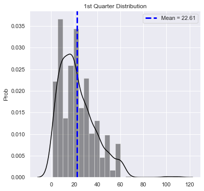


    SHAPIRO-WILK TEST at alpha = 0.05:
    The null hypothesis that sample was drawn from a normal distribution is REJECTED at p = 5.705675247467873e-19
    
    D'AGOSTINO-PEARSON TEST at alpha = 0.05:
    The null hypothesis that sample was drawn from a normal distribution is REJECTED at p = 3.177090698584879e-29
    
    ANDERSON-DARLING TEST at alpha = 0.05:
    The null hypothesis that sample was drawn from a normal distribution is REJECTED.
    Test Statistic: 13.92138167452299 > Critical Value 0.782
    N = 672
    


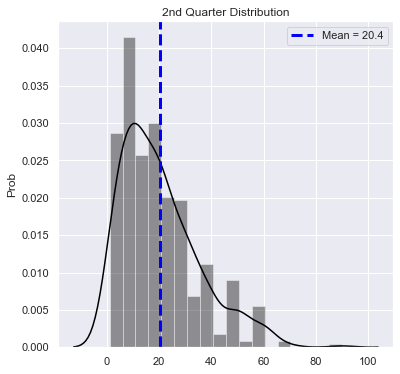


    SHAPIRO-WILK TEST at alpha = 0.05:
    The null hypothesis that sample was drawn from a normal distribution is REJECTED at p = 5.4461926225538e-16
    
    D'AGOSTINO-PEARSON TEST at alpha = 0.05:
    The null hypothesis that sample was drawn from a normal distribution is REJECTED at p = 9.711319134489651e-18
    
    ANDERSON-DARLING TEST at alpha = 0.05:
    The null hypothesis that sample was drawn from a normal distribution is REJECTED.
    Test Statistic: 11.189396784354983 > Critical Value 0.78
    N = 472
    


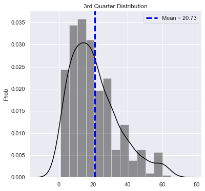


    SHAPIRO-WILK TEST at alpha = 0.05:
    The null hypothesis that sample was drawn from a normal distribution is REJECTED at p = 3.9548476527071635e-14
    
    D'AGOSTINO-PEARSON TEST at alpha = 0.05:
    The null hypothesis that sample was drawn from a normal distribution is REJECTED at p = 3.719281922153481e-12
    
    ANDERSON-DARLING TEST at alpha = 0.05:
    The null hypothesis that sample was drawn from a normal distribution is REJECTED.
    Test Statistic: 9.066207714290556 > Critical Value 0.78
    N = 425
    


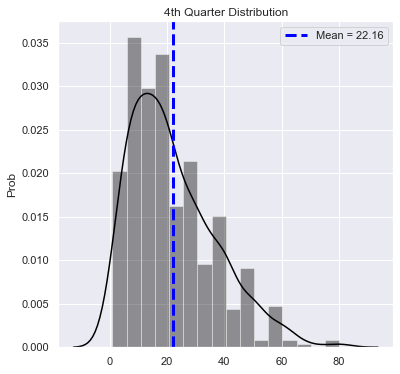


    SHAPIRO-WILK TEST at alpha = 0.05:
    The null hypothesis that sample was drawn from a normal distribution is REJECTED at p = 3.522732735874198e-15
    
    D'AGOSTINO-PEARSON TEST at alpha = 0.05:
    The null hypothesis that sample was drawn from a normal distribution is REJECTED at p = 2.0676694236247593e-14
    
    ANDERSON-DARLING TEST at alpha = 0.05:
    The null hypothesis that sample was drawn from a normal distribution is REJECTED.
    Test Statistic: 10.41822771237753 > Critical Value 0.781
    N = 511
    

Do these data meet the requirements for a one-way ANOVA test?

1) Is each record in data distinct and independent? -> Yes

2) Are samples normally distriuted, OR is N >= 25? -> Yes

3) Is homogeneity of variance present? (Only needed for sharply unequal sample sizes) -> No (But sample sizes are not 'SHARPLY' unequal (672 vs 472 vs 425 vs 511), so this assumption is met.)

Therefore, I conclude that the one-way ANOVA is suitable for these samples, but I will also perform a Kruskal-Wallis test as a non-parametric check.

## Test: One-Way ANOVA (Kruskal-Wallis)


```python
f_st, p_val = stats.f_oneway(
    q_dict2['1st Quarter'], q_dict2['2nd Quarter'], q_dict2['3rd Quarter'], q_dict2['4th Quarter'])

alpha = 0.05

if p_val < 0.05:
    print('ONE-WAY ANOVA TEST RESULT:\n')
    print(
        f'The null hypothesis IS rejected at alpha={alpha}, with a p-value of {round(p_val,3)}')
else:
    print('ONE-WAY ANOVA TEST RESULT:\n')
    print(
        f'The null hypothesis is NOT rejected at alpha={alpha}, with a p-value of {round(p_val,3)}')
```

    ONE-WAY ANOVA TEST RESULT:
    
    The null hypothesis IS rejected at alpha=0.05, with a p-value of 0.041
    


```python
st, p_val = stats.kruskal(q_dict2['1st Quarter'], q_dict2['2nd Quarter'],
                          q_dict2['3rd Quarter'], q_dict2['4th Quarter'])

alpha = 0.05

if p_val < 0.05:
    print('KRUSKAL-WALLIS TEST RESULT:\n')
    print(
        f'The null hypothesis IS rejected at alpha={alpha}, with a p-value of {round(p_val,3)}')
else:
    print('KRUSKAL-WALLIS TEST RESULT:\n')
    print(
        f'The null hypothesis is NOT rejected at alpha={alpha}, with a p-value of {round(p_val,3)}')
```

    KRUSKAL-WALLIS TEST RESULT:
    
    The null hypothesis IS rejected at alpha=0.05, with a p-value of 0.028
    

Both the one-way ANOVA and Kruskal-Wallis test indicate a signficant difference between at least two of the sample groups. I will now perform a post-hoc test to determine which of the groups are significantly different.

## Post-Hoc Test: Tukey's HSD


```python
df4_1 = pd.DataFrame([])
df4_1['Quantity'] = q_dict2['1st Quarter']
df4_1['Q'] = 1
df4_2 = pd.DataFrame([])
df4_2['Quantity'] = q_dict2['2nd Quarter']
df4_2['Q'] = 2
df4_3 = pd.DataFrame([])
df4_3['Quantity'] = q_dict2['3rd Quarter']
df4_3['Q'] = 3
df4_4 = pd.DataFrame([])
df4_4['Quantity'] = q_dict2['4th Quarter']
df4_4['Q'] = 4

df4 = pd.concat([df4_1, df4_2, df4_3, df4_4])
```


```python
q4b_result = sm.stats.multicomp.pairwise_tukeyhsd(
    endog=df4.Quantity, groups=df4.Q)
q4b_result.summary()
```


<table class="simpletable">
<caption>Multiple Comparison of Means - Tukey HSD, FWER=0.05</caption>
<tr>
  <th>group1</th> <th>group2</th> <th>meandiff</th>  <th>p-adj</th>  <th>lower</th>   <th>upper</th> <th>reject</th>
</tr>
<tr>
     <td>1</td>      <td>2</td>    <td>-2.2088</td>  <td>0.066</td> <td>-4.5135</td> <td>0.0958</td>  <td>False</td>
</tr>
<tr>
     <td>1</td>      <td>3</td>    <td>-1.8754</td> <td>0.1781</td> <td>-4.2537</td> <td>0.5029</td>  <td>False</td>
</tr>
<tr>
     <td>1</td>      <td>4</td>    <td>-0.4486</td>   <td>0.9</td>  <td>-2.701</td>  <td>1.8037</td>  <td>False</td>
</tr>
<tr>
     <td>2</td>      <td>3</td>    <td>0.3335</td>    <td>0.9</td>  <td>-2.2326</td> <td>2.8995</td>  <td>False</td>
</tr>
<tr>
     <td>2</td>      <td>4</td>    <td>1.7602</td>  <td>0.2515</td> <td>-0.6896</td>  <td>4.21</td>   <td>False</td>
</tr>
<tr>
     <td>3</td>      <td>4</td>    <td>1.4267</td>  <td>0.4656</td> <td>-1.0925</td>  <td>3.946</td>  <td>False</td>
</tr>
</table>


```python
plt.figure(figsize=(14, 6))

plt.subplot(121)
plt.ylabel('Mean Quantity per Product per Order')
for k, v in q_dict2.items():
    plt.bar(x=k, height=np.mean(v), yerr=stats.sem(
        v), linewidth=1, edgecolor='black')
    
plt.subplot(122)
sns.stripplot(x=df4.Q, y=df4.Quantity, jitter=0.4)
plt.xticks(ticks=[0, 1, 2, 3], labels=['1st Quarter',
                                       '2nd Quarter', '3rd Quarter', '4th Quarter'])
plt.ylabel('Quantity per Product per Order')
plt.xlabel('')

plt.suptitle('Quantity of Product per Order', y=0.95)
plt.show();
```


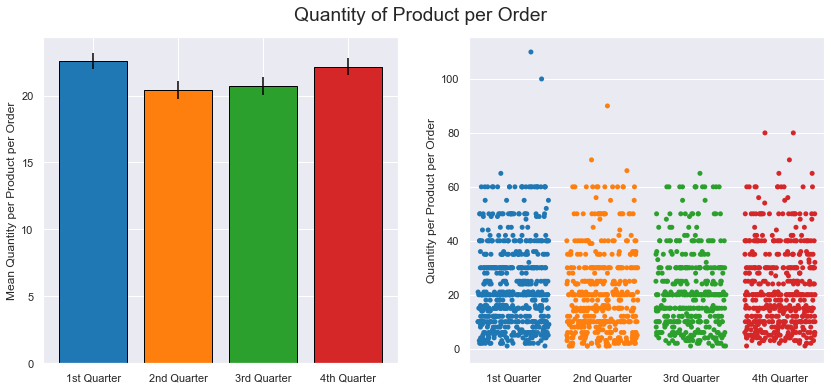


## Interpretation: Question 4
The post-hoc pairwise Tukey's HSD test does not indicate significance between any groups at alpha = 0.05, however, the difference between the 1st and 2nd quarters carries a p-value of 0.066. This is likely the difference that resulted in the signficant one-way ANOVA and Kruskal-Wallis results. 

Therefore, I conclude that we can reject the null hypothesis of no signficant difference between groups (quarters). 

However, this information may not be very useful from a practical standpoint, as the post-hoc pairwise Tukey's HSD test indicates that at alpha = 0.05, there is no signficant difference between the groups. The largest mean difference (~ 2 items per product per order) occurs between quarters 1 and 2.

# Conclusions

1) There appears to be a significant difference in the quantity of a product ordered when a discount is present at a level of 5% or above, vs. when no discount is present.

2) The shipper used does not appear to have significant effect on freight price.

3) The specific employee appears to have a significant effect on the number of repeat orders a customer will make. Employee 9 appears to be less successful in securing repeat orders from customers.

4) The time of year in which an order is placed (quarter) appears to have a significant effect on quantity of a product per order, however, post-hoc testing does not reveal a significant difference between groups at alpha = 0.05.

## Recommendations

1) Apply discounts more frequently to increase the quantity of products sold per order.

2) Limit discount amounts to 5%, since this appears to be the minimum needed to have a significant impact.

3) Employee 9 should receive some type of customer relationship mentorship or training from another employee that has been more successful in obtaining repeat orders from customers.

## Future Work

1) Would like to do additional testing for employees after customer relationship training / mentorship to see what kind of impact this has had.

2) Would like to explore these same tests using additional data from previous or more recent years.
